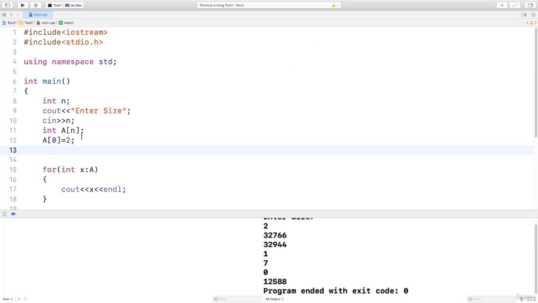
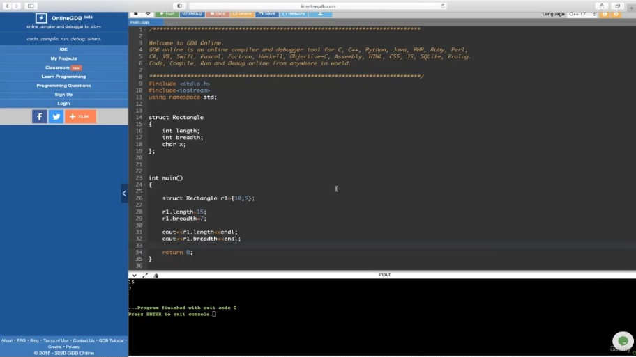
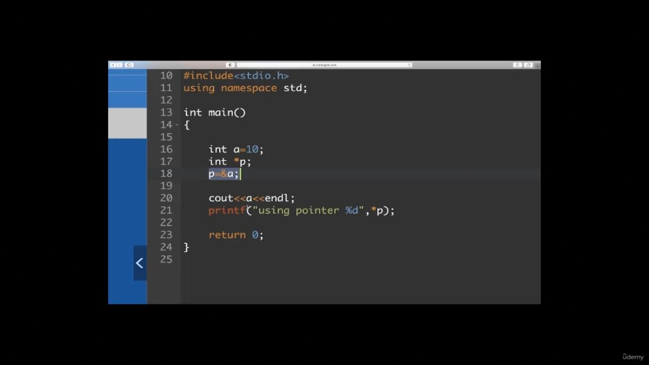
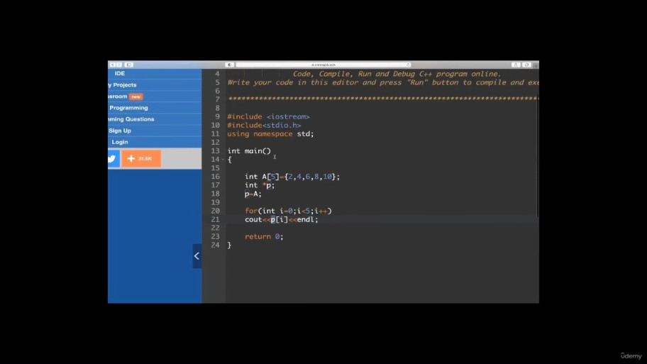
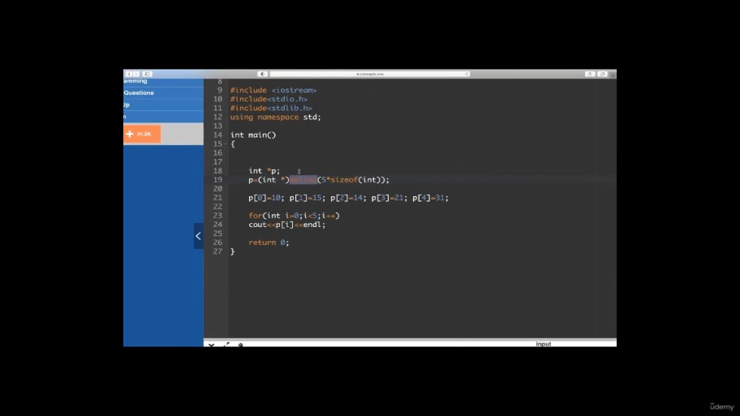
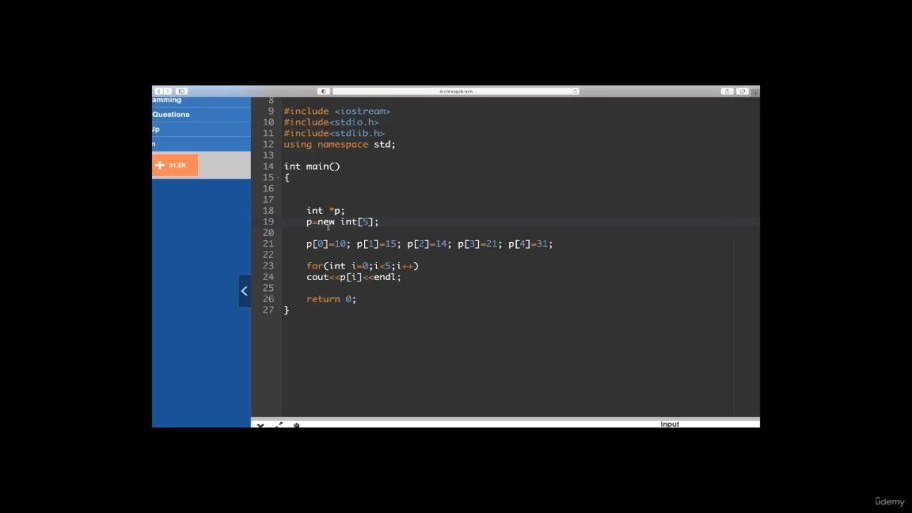
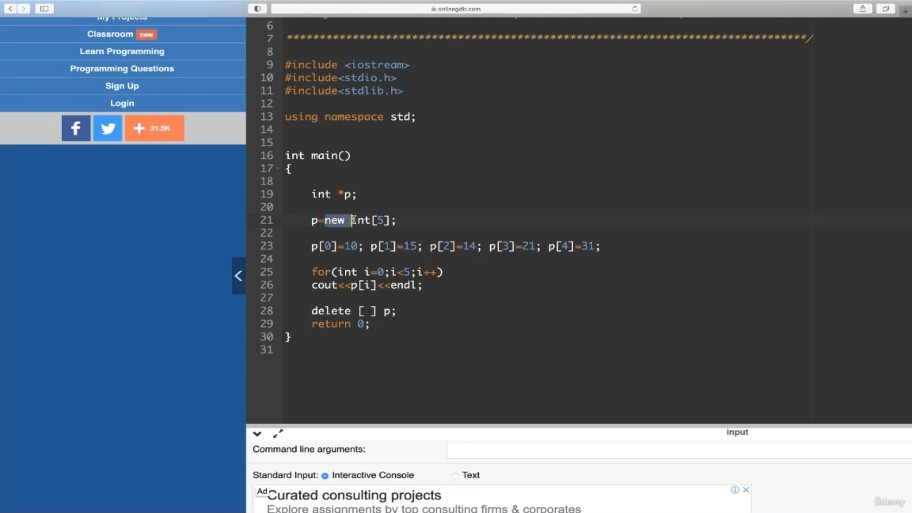
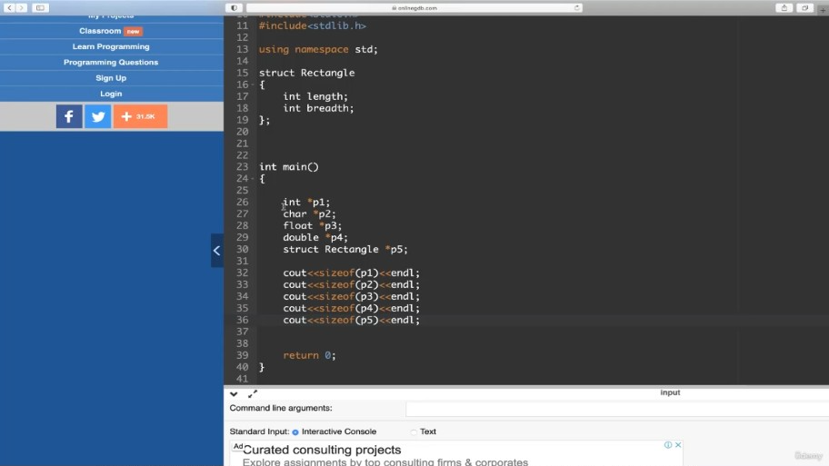
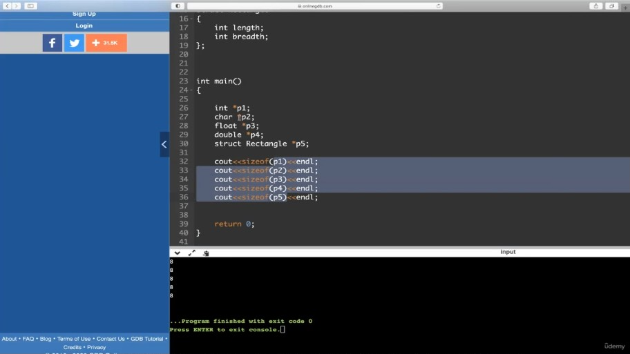

# Essential C and CPP Concepts

## Table of Contents
- [Essential C and CPP Concepts](#essential-c-and-cpp-concepts)
  - [Table of Contents](#table-of-contents)
  - [📘 Arrays (Basics \& Memory Representation)](#-arrays-basics--memory-representation)
    - [🔹 Overview](#-overview)
    - [🔹 Concepts Explained](#-concepts-explained)
      - [✅ What is an Array?](#-what-is-an-array)
      - [✅ Array Indexing](#-array-indexing)
      - [✅ Memory Allocation](#-memory-allocation)
      - [✅ Declaration and Initialization](#-declaration-and-initialization)
      - [✅ Accessing Array Elements](#-accessing-array-elements)
    - [🔹 Definitions](#-definitions)
    - [🔹 Diagrams or Described Visuals](#-diagrams-or-described-visuals)
    - [🔹 Time and Space Complexities](#-time-and-space-complexities)
    - [🔹 Code Examples](#-code-examples)
    - [🔹 Instructor Tips or Mnemonics](#-instructor-tips-or-mnemonics)
    - [🔹 Interview-Style Questions](#-interview-style-questions)
    - [🔹 Final Takeaways](#-final-takeaways)
  - [📘 Arrays – Practical Concepts \& Demonstration (Self-Study Notes)](#-arrays--practical-concepts--demonstration-self-study-notes)
    - [🛠️ Development Setup](#️-development-setup)
    - [🔢 What is an Array?](#-what-is-an-array-1)
      - [📌 Declaration:](#-declaration)
    - [🧠 Understanding Indexing \& Memory](#-understanding-indexing--memory)
    - [🧾 C vs C++ Syntax for Output](#-c-vs-c-syntax-for-output)
    - [🧮 Array Initialization Methods](#-array-initialization-methods)
      - [1. **Explicit Initialization**](#1-explicit-initialization)
      - [2. **Omit Size (auto-detect)**](#2-omit-size-auto-detect)
      - [3. **Partial Initialization**](#3-partial-initialization)
      - [4. **Single Zero Initialization**](#4-single-zero-initialization)
    - [🔁 Accessing Arrays](#-accessing-arrays)
      - [1. **Using `for` loop**](#1-using-for-loop)
      - [2. **Using C++ For-each loop**](#2-using-c-for-each-loop)
    - [🧾 Variable Size Arrays (VLA)](#-variable-size-arrays-vla)
      - [Input-based array size:](#input-based-array-size)
      - [⚠️ Limitations:](#️-limitations)
      - [Alternative:](#alternative)
    - [🧹 Important Notes](#-important-notes)
    - [✅ Key Takeaways](#-key-takeaways)
  - [📘 Structures in C/C++ – Self-Study Notes](#-structures-in-cc--self-study-notes)
    - [📌 What is a Structure?](#-what-is-a-structure)
    - [💡 Why Use Structures?](#-why-use-structures)
    - [🧱 Structure Syntax](#-structure-syntax)
      - [✅ Definition](#-definition)
      - [✅ Declaration](#-declaration-1)
      - [✅ Declaration + Initialization](#-declaration--initialization)
    - [🔧 Accessing Structure Members](#-accessing-structure-members)
    - [🧠 Memory Consideration](#-memory-consideration)
    - [🧑‍🎓 Example Use Cases](#-example-use-cases)
      - [1. ✅ **Complex Number**](#1--complex-number)
      - [2. ✅ **Student Info**](#2--student-info)
      - [3. ✅ **Playing Card**](#3--playing-card)
    - [📚 Array of Structures](#-array-of-structures)
      - [Accessing Elements:](#accessing-elements)
    - [🛠️ Key Points](#️-key-points)
    - [🧠 Next Topics (Preview)](#-next-topics-preview)
  - [📘 Structures in C/C++ (Demo \& Explanation)](#-structures-in-cc-demo--explanation)
  - [](#)
    - [✅ Clear Definitions](#-clear-definitions)
    - [🎯 Why / When to Use](#-why--when-to-use)
    - [💻 Code Examples](#-code-examples-1)
      - [🔹 Defining and Declaring a Structure](#-defining-and-declaring-a-structure)
      - [🔹 Defining + Declaring Together](#-defining--declaring-together)
      - [🔹 Initializing Members](#-initializing-members)
      - [🔹 Accessing Members](#-accessing-members)
      - [🔹 Changing Member Values](#-changing-member-values)
      - [🔹 Calculating Size of Structure](#-calculating-size-of-structure)
    - [📊 Structure Memory Layout \& Padding](#-structure-memory-layout--padding)
    - [🧠 Memory / Execution Explanation](#-memory--execution-explanation)
    - [⚠️ Common Mistakes / Warnings](#️-common-mistakes--warnings)
    - [📦 Key Takeaways](#-key-takeaways-1)
  - [📘 Pointers in C/C++ (Definition, Memory, Initialization, and Heap Allocation)](#-pointers-in-cc-definition-memory-initialization-and-heap-allocation)
    - [✅ Clear Definitions](#-clear-definitions-1)
    - [🎯 Why / When to Use Pointers](#-why--when-to-use-pointers)
    - [💻 Code Examples](#-code-examples-2)
      - [🔹 Basic Pointer Usage](#-basic-pointer-usage)
      - [🔹 Accessing Heap Memory (C Style)](#-accessing-heap-memory-c-style)
      - [🔹 Accessing Heap Memory (C++ Style)](#-accessing-heap-memory-c-style-1)
    - [📊 Declaration, Initialization \& Dereferencing Summary](#-declaration-initialization--dereferencing-summary)
    - [🧠 Memory / Execution Explanation](#-memory--execution-explanation-1)
      - [🔸 Memory Sections](#-memory-sections)
    - [⚠️ Common Mistakes / Warnings](#️-common-mistakes--warnings-1)
    - [📦 Key Takeaways](#-key-takeaways-2)
  - [📘 Pointer Demonstration in C/C++](#-pointer-demonstration-in-cc)
    - [✅ Clear Definitions](#-clear-definitions-2)
    - [🎯 Why / When to Use](#-why--when-to-use-1)
    - [💻 Code Examples](#-code-examples-3)
      - [🔹 Basic Pointer Demo](#-basic-pointer-demo)
      - [🔹 Accessing Address vs. Value](#-accessing-address-vs-value)
      - [🔹 Pointer to an Array](#-pointer-to-an-array)
      - [🔹 Heap Memory Allocation](#-heap-memory-allocation)
        - [C Style:](#c-style)
        - [C++ Style:](#c-style-1)
      - [🔹 Assigning Heap Array Values](#-assigning-heap-array-values)
      - [🔹 Deallocating Heap Memory](#-deallocating-heap-memory)
    - [📊 Table: Pointer Declaration, Initialization, Dereferencing](#-table-pointer-declaration-initialization-dereferencing)
    - [📊 Table: Pointer vs Variable Memory Allocation](#-table-pointer-vs-variable-memory-allocation)
    - [📊 Pointer Sizes (Very Important)](#-pointer-sizes-very-important)
    - [🧠 Memory / Execution Explanation](#-memory--execution-explanation-2)
    - [⚠️ Common Mistakes / Warnings](#️-common-mistakes--warnings-2)
    - [📦 Key Takeaways](#-key-takeaways-3)

## 📘 Arrays (Basics & Memory Representation)

---

### 🔹 Overview

This chapter introduces the concept of arrays in C/C++. It covers how to declare, initialize, and access arrays, and where arrays are stored in memory. The section serves as a revision of basic C programming skills, essential for understanding future data structure concepts.

---

### 🔹 Concepts Explained

#### ✅ What is an Array?

* An array is a **collection of similar data types**, stored at **contiguous memory locations**.
* It allows grouping multiple values (like integers or floats) under a single name.
* Example: `int A[5];` declares an array of 5 integers.
* each location is if integer then total size of array would be = no. of elements * size of int datatype

#### ✅ Array Indexing

* Array indices start from **0 to n-1** (if size is `n`).
* Example: `A[0] = 27; A[1] = 10;`

#### ✅ Memory Allocation

* Arrays declared **inside a function** are stored in the **stack section** of memory.
* Memory layout of main memory:

  * **Code section**
  * **Stack** → Arrays declared in functions reside here.
  * **Heap**

#### ✅ Declaration and Initialization

* Declaration without initialization:

  ```c
  int A[5];
  ```
* Declaration with initialization:

  ```c
  int B[5] = {2, 9, 6, 8, 10};
  ```

#### ✅ Accessing Array Elements

* Use a `for` loop to iterate through array elements:

  ```c
  for (int i = 0; i < 5; i++) {
      printf("%d ", B[i]);
  }
  ```

---

### 🔹 Definitions

| Term           | Definition                                                             |
| -------------- | ---------------------------------------------------------------------- |
| Array          | Collection of similar data types stored in contiguous memory locations |
| Index          | Position of an element in the array, starting from 0                   |
| Declaration    | Syntax to allocate memory for array without assigning values           |
| Initialization | Assigning values to the array during its declaration                   |

---

### 🔹 Diagrams or Described Visuals

* **Array Visualization**:

  ```
  Index:     0     1     2     3     4
            --------------------------
  Array A: | 27 | 10 |     |     |     |
            --------------------------
  ```

* **Memory Layout**:

  ```
  +-------------------+
  |    Code Section   |
  +-------------------+
  |       Stack       | ← Array A, B stored here
  +-------------------+
  |       Heap        |
  +-------------------+
  ```

---

### 🔹 Time and Space Complexities

| Operation              | Time Complexity | Space Complexity |
| ---------------------- | --------------- | ---------------- |
| Access (A\[i])         | O(1)            | O(1)             |
| Traversal (loop)       | O(n)            | O(1)             |
| Initialization (fixed) | O(n)            | O(n)             |

---

### 🔹 Code Examples

✅ **Declaration and Initialization**:

```c
int A[5];                  // Declaration
int B[5] = {2, 9, 6, 8, 10}; // Initialization
```

✅ **Accessing Array Elements using Loop**:

```c
for (int i = 0; i < 5; i++) {
    printf("%d ", B[i]);
}
```

* This prints: `2 9 6 8 10`

---

### 🔹 Instructor Tips or Mnemonics

* Index starts at **0**, not 1.
* Arrays declared in functions go to the **stack**.
* Always use loops like `for` to access all array elements.

---

### 🔹 Interview-Style Questions

1. What is the time complexity of accessing an element in an array?
2. How are arrays stored in memory in C?
3. Difference between declaration and initialization?
4. Why do array indices start at 0?
5. What section of memory holds arrays declared inside a function?

---

### 🔹 Final Takeaways

* Arrays group similar elements using a single identifier.
* Indexing begins from 0.
* Arrays in functions live in stack memory.
* Declaration and initialization can be done together or separately.
* Loops are essential to access array elements efficiently.

---
Here are **well-structured self-study notes** based on the *“Practice: Arrays Basics”* lecture, written in a way that helps you **revise, understand concepts, and prepare for implementation-based questions**:

---

## 📘 Arrays – Practical Concepts & Demonstration (Self-Study Notes)


### 🛠️ Development Setup

* **IDE Used in Demo**: Xcode on macOS
* **Languages**: C and C++
* **Practice Options**:

  * Local IDE: Xcode, Code::Blocks, Turbo C++, etc.
  * Online Compiler: [https://www.onlinegdb.com](https://www.onlinegdb.com)

    > Select C++ compiler → Preloaded with `main()`, `#include <iostream>` and `using namespace std`.

---

### 🔢 What is an Array?

* Array is a **contiguous block of memory** to store elements of the same data type.
* Accessed via **indexing**, starting from **0**.
* Can be declared and initialized in both C and C++.

#### 📌 Declaration:

```cpp
int A[5]; // Declares an integer array of size 5
```

---

### 🧠 Understanding Indexing & Memory

```cpp
A[0] = 12;
A[1] = 15;
A[2] = 25;
```

* Stores values at respective indices
* Total indices: `0 to size-1` → `A[0]` to `A[4]`
* Memory size = `size * sizeof(int)`
  e.g., If `int = 4 bytes` → `5 * 4 = 20 bytes`

```cpp
cout << sizeof(A); // Outputs 20
```

---

### 🧾 C vs C++ Syntax for Output

| Language | Function   |
| -------- | ---------- |
| C        | `printf()` |
| C++      | `cout`     |

You can mix both in most compilers:

```cpp
cout << A[1] << endl;   // C++ style
printf("%d\n", A[2]);   // C style
```

---

### 🧮 Array Initialization Methods

#### 1. **Explicit Initialization**

```cpp
int A[5] = {2, 4, 6, 8, 10};
```

#### 2. **Omit Size (auto-detect)**

```cpp
int A[] = {2, 4, 6, 8, 10, 12, 14}; // Size is 7
```

#### 3. **Partial Initialization**

```cpp
int A[10] = {2, 4, 6}; // Remaining 7 elements = 0
```

#### 4. **Single Zero Initialization**

```cpp
int A[10] = {0}; // All 10 elements = 0
```

---

### 🔁 Accessing Arrays

#### 1. **Using `for` loop**

```cpp
for (int i = 0; i < 10; i++)
    cout << A[i] << endl;
```

#### 2. **Using C++ For-each loop**

```cpp
for (int x : A)
    cout << x << endl;
```

> 🚨 Works only in **C++**, and with **fixed size arrays**

---

### 🧾 Variable Size Arrays (VLA)

#### Input-based array size:

```cpp
int n;
cin >> n;
int A[n]; // Variable length array (allowed in C and modern C++)
```

#### ⚠️ Limitations:

* Cannot be initialized directly (`int A[n] = {2, 4}` ❌)
* Remaining values are **garbage** (including zero if not set by you)
* Some compilers don’t fully support VLA; behavior is **compiler-dependent**

#### Alternative:

```cpp
for (int i = 0; i < n; i++)
    cin >> A[i]; // Manual initialization
```

---

### 🧹 Important Notes

* **Garbage value ≠ 0**: Even if you see 0, it may still be uninitialized.
* **Use constants for array size** when fixed:

  ```cpp
  const int SIZE = 10;
  int A[SIZE];
  ```
* C and C++ differ mainly in:

  * `printf` vs `cout`
  * `#include <stdio.h>` vs `#include <iostream>`

---

### ✅ Key Takeaways

| Concept                      | Description                                          |
| ---------------------------- | ---------------------------------------------------- |
| Array Memory                 | Contiguous, fixed-size, same data type               |
| Initialization               | Partial → uninitialized = 0; full = all defined      |
| Size                         | Can be deduced (via init) or input-based (VLA)       |
| Accessing                    | Via index or range-based loop in C++                 |
| VLA (Variable Length Arrays) | Compiler-dependent, avoid if you need initialization |
| C vs C++ usage               | Interchangeable for basics; just use correct headers |

---

Here are your **self-study notes on Structures in C/C++**, based on both the lecture transcript and the content from your uploaded PDF (`Structures-5.pdf`). These are structured to help you revise and implement code confidently:

---

## 📘 Structures in C/C++ – Self-Study Notes

---

### 📌 What is a Structure?

* A **structure** is a user-defined data type in C/C++.
* It groups **multiple related data members** (similar or dissimilar types) under a SINGLE NAME.
* It allows creation of **complex data models** beyond primitive types like `int`, `char`, `float`.

---

### 💡 Why Use Structures?

* To logically group related variables (e.g., length & breadth of a rectangle, student records).
* Helpful in modeling **real-world entities** like:

  * `Rectangle`
  * `Complex numbers`
  * `Student / Employee`
  * `Playing Cards`, `Bank Records`, etc.

---

### 🧱 Structure Syntax

#### ✅ Definition

```c
struct Rectangle {
    int length;
    int breadth;
};
```

* Does **not allocate memory** until a variable of the structure is declared.

#### ✅ Declaration

```c
struct Rectangle r;  // Memory allocated now
```

#### ✅ Declaration + Initialization

```c
struct Rectangle r = {10, 5}; // length = 10, breadth = 5
```

```plaintext
+----------------------+
|      Main Memory     |
+----------------------+
|        Heap          |
|      (grows up)      |
+----------------------+
|                      |
|        Stack         |
|    +------------+    |
|    |   r        |    | <- variable 'r' of type struct Rectangle
|    | +--------+ |    |
|    | | length | | -> 10
|    | | breadth| | -> 5
|    +------------+    |
+----------------------+
|                      |
|    Code Section      |
|    (Instructions)    |
+----------------------+

```
---

### 🔧 Accessing Structure Members

Use the **dot (`.`) operator**:

```c
r.length = 15;
r.breadth = 10;

printf("Area is %d", r.length * r.breadth);
```

---

### 🧠 Memory Consideration

* Memory consumed = Sum of sizes of all data members.
* Example: 2 integers = 4 bytes (if each `int` = 2 bytes) or 8 bytes (if 4 bytes each).
* Memory is allocated on the **stack** when declared in a function like `main()`.

---

### 🧑‍🎓 Example Use Cases

#### 1. ✅ **Complex Number**

```c
struct Complex {
    int real; //2bytes
    int imag; //2bytes
}; // 4 Bytes
```

#### 2. ✅ **Student Info**

```c
struct Student {
    int rollNo;
    char name[25];
    char dept[10];
    char address[50];
};
```

* Estimated size = `2 + 25 + 10 + 50 = 87 bytes` (assuming `int = 2 bytes`).

#### 3. ✅ **Playing Card**

```c
struct Card {
    int face;   // 1 to 13
    int shape;  // 0: Club, 1: Spade, 2: Diamond, 3: Heart
    int color;  // 0: Black, 1: Red
};
```

---

### 📚 Array of Structures

Declare multiple objects of structure using arrays:

```c
struct Card deck[52]; // 52 cards
// TOTAL SIZE = 52*(2+2+2) = 312 Bytes

// Initialize manually
deck[0].face = 1; // Ace
deck[0].shape = 0; // Club
deck[0].color = 0; // Black

// OR initialize at declaration
struct Card deck[] = {
    {1, 0, 0},
    {2, 0, 0},
    {1, 1, 0},
    {2, 1, 0}
    // ...
};
```

#### Accessing Elements:

```c
printf("%d", deck[0].face);
printf("%d", deck[0].shape);
```

---

### 🛠️ Key Points

| Concept              | Description                                      |
| -------------------- | ------------------------------------------------ |
| `struct` keyword     | Used to define a structure                       |
| `.` operator         | Used to access structure members                 |
| Memory allocation    | Happens only when structure variable is declared |
| Initialization       | Can be done using curly braces `{}`              |
| Arrays of structures | Enables batch handling of complex objects        |

---

### 🧠 Next Topics (Preview)

* Pointers to structures
* Passing structures to functions
* Returning structures from functions
* Nested structures (structure inside another structure)

---

## 📘 Structures in C/C++ (Demo & Explanation)


---

### ✅ Clear Definitions

**Structure (`struct`)** is a **user-defined data type** in C/C++ that allows grouping variables of different data types under one name.

* Syntax:

  ```c
  struct StructureName {
      dataType member1;
      dataType member2;
      ...
  };
  ```

* Example:

  ```c
  struct Rectangle {
      int length;
      int breadth;
  };
  ```

---

### 🎯 Why / When to Use

* When you need to model real-world entities (like a rectangle) with multiple attributes.
* Useful in creating **data records** (e.g., student info, coordinates, etc.)
* Promotes modular programming and **custom data structures**.

---

### 💻 Code Examples

#### 🔹 Defining and Declaring a Structure
- Defination doesn't consume memory unless and until you declare any variable of this type structure
- Declaring Stuff outside main() lead to Global declaration, hence can be accessed throughout the program. you can do any.

```c
// Structure definition
struct Rectangle {
    int length;
    int breadth;
};

// Variable declaration
struct Rectangle r1;
```

#### 🔹 Defining + Declaring Together
- smart, same stuff
```c
struct Rectangle {
    int length;
    int breadth;
} r1, r2, r3;
```

#### 🔹 Initializing Members

```c
r1.length = 10;
r1.breadth = 5;
```

#### 🔹 Accessing Members

```cpp
cout << r1.length << endl;
cout << r1.breadth << endl;
```

#### 🔹 Changing Member Values

```cpp
r1.length = 15;
r1.breadth = 7;
```

#### 🔹 Calculating Size of Structure

```cpp
printf("%lu", sizeof(r1)); // Use %lu for long unsigned int
```

---

### 📊 Structure Memory Layout & Padding

| Member  | Data Type | Size (Bytes)   |
| ------- | --------- | -------------- |
| length  | `int`     | 4              |
| breadth | `int`     | 4              |
| x       | `char`    | 1 (+3 padding) |

* **Total Actual Size**: 9 bytes
* **Memory Allocated**: 12 bytes due to **padding**

- It's Easy for MACHINE to Read in group Bytes (here 4 )
- but, even if it alot 4 to char, still char gonna use 1 only.
- Like Pharmacy seller sell Strips instead of specific requirement.
- For Easy Accessibility,Allocation of char taking nearest bigger size (that is int here)

---

### 🧠 Memory / Execution Explanation

* **Variables inside `main()`** → Stored in **Stack**
* **Global struct variables** → Stored in **Data Segment**
* Structure memory is laid out **contiguously**, with padding to align with CPU word size (commonly 4 bytes).
* Padding helps processor access memory faster (e.g., 4 bytes at a time).

---

### ⚠️ Common Mistakes / Warnings

* ❗ Using `%d` with `sizeof()` gives warning → use `%lu` instead.
* ❗ Assuming structure size is sum of member sizes (forgetting **padding**).
* ❗ Not using the correct **dot operator (`.`)** for accessing structure members.
* ❗ Declaring a struct without later defining a variable → no memory is allocated.

---

### 📦 Key Takeaways

* ✅ A **structure** groups related data under one name.
* ✅ Defined using `struct`, and can include variables of different data types.
* ✅ Structure **definition** doesn't consume memory unless a variable is declared.
* ✅ You can declare struct variables globally or locally.
* ✅ Access members using the **dot operator (`.`)**.
* ✅ **Padding** may increase structure size for memory alignment.
* ✅ Use `sizeof()` to check the total memory occupied (consider padding).
* ✅ C++ allows both C-style and C++-style use of structures.
* ✅ Use an online compiler like [OnlineGDB](https://www.onlinegdb.com/) to practice.

---

## 📘 Pointers in C/C++ (Definition, Memory, Initialization, and Heap Allocation)

---

### ✅ Clear Definitions

**Pointer(Address Var)**:
A **pointer** is a *special variable* that stores the **memory address** of another variable (not the actual value).
It enables **indirect access** to data and is central to dynamic memory management, efficient parameter passing, and accessing external resources.

* **Data Variable** → stores data
* **Pointer Variable** → stores address of data

```plaintext
                          +-----------------+
                          |     CPU         |
                          +--------+--------+
                                   |
                                   v
        +------------------+     Accessing   +---------------------+
        |    Main Memory   |<----------------|     Code Section     |
        |------------------|                 +---------------------+
        |      Heap        | <---+       
        |------------------|     |  Pointer accesses heap memory
        |      Stack       | <---+
        |------------------|       (local variables, return addresses)
        |     main()       | <---+
        |------------------|       (actual function execution)
        |   Code Section   | <---+
        +------------------+

Explanation of Layout:
----------------------

Main Memory:
------------
+-----------------------+
|       Heap            |  <- dynamic memory (malloc/new)
+-----------------------+
|       Stack           |  <- function call frames, local vars
+-----------------------+
|       main()          |  <- currently executing code
+-----------------------+
|     Code Section      |  <- instructions (executable code)
+-----------------------+

Pointer Use-Cases:
------------------
1. Accessing Heap
2. Accessing Resources (e.g. hardware buffers, file pointers)
3. Parameter Passing (function arguments by address)
```
---

### 🎯 Why / When to Use Pointers

✅ **1. Accessing Heap Memory**
Heap memory is **outside the direct reach** of a program. To use it, pointers are mandatory.

✅ **2.Accessing External Resources**
Pointers help access resources like:

* Files on disk
* Keyboard, mouse, monitor
* Network and internet sockets

✅ **3. Parameter Passing**
Pointers allow:

* **Pass-by-reference** (efficient memory usage)
* Modifying actual arguments in functions

✅ **4. Dynamic Memory Allocation**
Needed when size of data is not known at compile time.

---

### 💻 Code Examples

#### 🔹 Basic Pointer Usage

```c
#include <stdio.h>

int main() {
    int a = 10;        // Data variable
    int *p;            // Pointer declaration
    p = &a;            // Initialization

    printf("%d\n", a);     // Direct access
    printf("%d\n", *p);    // Dereferencing: indirect access
}
```

```plaintext
📘 Topic: Pointers in C

Code:
-----
int main() {
    int a = 10;       // data variable 200/201
    int *p;           // address variable (pointer) 210/211
    p = &a;           // pointer p stores address of a 

    printf("%d", a);     // Output: 10
    printf("%d", *p);    // Output: 10 (dereferencing pointer)
}

Memory Layout:
--------------

Main Memory
+----------------------+
|        Heap          |
+----------------------+
|        Stack         |
|  ------------------  |
|  |    a = 10      |  |  <-- Value of variable 'a'
|  |  (Addr: 200)   |  |
|  ------------------  |
|  |    p = 200     |  |  <-- Pointer p holds address of a
|  |  (Addr: 210)   |  |
+----------------------+
|     main() Code      |
+----------------------+
|    Code Section      |
+----------------------+

Explanation:
------------

- Variable `a` is stored at address **200 & 201**, with value `10`.
- Pointer `p` is stored at address **210 & 211**, and contains the value `200` (i.e., the address of `a`).
- `*p` dereferences the pointer `p` to access the value at address `200`, which is `10`.

Output:
-------
10
10
```

#### 🔹 Accessing Heap Memory (C Style)

```c
#include <stdio.h>
#include <stdlib.h>

int main() {
    int *p;
    p = (int *)malloc(5 * sizeof(int));  // Allocates space for 5 integers in heap
    // typecasting is imp as just malloc gives void pointer
}
```

```plaintext

📘 Topic: Dynamic Memory Allocation with Pointers (malloc & new)

Code (C):
----------
#include <stdlib.h>

int main() {
    int *p;
    p = (int *)malloc(5 * sizeof(int));  // Allocate memory for 5 integers
}

Code (C++):
-----------
int *p;
p = new int[5];  // C++ style memory allocation

Main Memory
+-----------------------------+
|           Heap              |
|  +-----+-----+-----+-----+  |
|  |  1  |  2  |  3  |  4  |  |  <-- Allocated by malloc/new
|  +-----+-----+-----+-----+  |
|  (Start Addr: 5000)         |
+-----------------------------+
|           Stack             |
|  +----------------------+  |
|  |        p = 5000      |  |  <-- Pointer p stores address of heap block
|  +----------------------+  |
+-----------------------------+
|         main()              |
+-----------------------------+
|       Code Section          |
+-----------------------------+

- malloc() dynamically allocates memory from the heap, not from the stack.
- The pointer p lives in the stack, but it points to memory in the heap.
- This allows allocation at runtime and memory reuse for arrays or large data.


- Efficient use of memory for large or variable-sized data.
- Necessary for data structures like linked lists, trees, graphs.
- Avoids stack overflow with large arrays.
```

#### 🔹 Accessing Heap Memory (C++ Style)

```cpp
#include <iostream>
using namespace std;

int main() {
    int *p;
    p = new int[5];   // Simple and type-safe
}
```

---

### 📊 Declaration, Initialization & Dereferencing Summary

| Syntax    | Purpose             | Example                          |
| --------- | ------------------- | -------------------------------- |
| `int *p;` | Pointer declaration | Creates address variable         |
| `p = &a;` | Initialization      | Stores address of `a`            |
| `*p`      | Dereferencing       | Accesses value at stored address |

---

### 🧠 Memory / Execution Explanation

#### 🔸 Memory Sections

| Section   | Purpose                     | Example                       |
| --------- | --------------------------- | ----------------------------- |
| **Code**  | Stores program instructions | `main()` and other functions  |
| **Stack** | Stores local variables      | `int a`, `int *p`             |
| **Heap**  | For dynamic memory          | `malloc()`, `new` allocations |

* Declaring a pointer inside `main()` → goes to **stack**
* Allocating memory using `malloc()` or `new` → goes to **heap**
* Access to heap must be done via a pointer

---

### ⚠️ Common Mistakes / Warnings

* ❗ **Confusing `*` in declaration vs. dereferencing**

  * `int *p;` declares pointer
  * `*p` accesses value at pointer
* ❗ Not using `sizeof()` with `malloc()` correctly

  ```c
  p = malloc(5 * sizeof(int));  // Correct
  ```
* ❗ Forgetting to `type-cast` `malloc()` result in C++
* ❗ Not freeing heap memory (use `free(p)` or `delete[] p` later)

---

### 📦 Key Takeaways

* ✅ **Pointer** stores the address of another variable.
* ✅ Used to **indirectly access data**.
* ✅ Required for accessing **heap** and **external resources**.
* ✅ **Stack** → for automatic/local variables. **Heap** → for dynamic memory.
* ✅ `*` is used both in declaration and dereferencing (context differs).
* ✅ `malloc()` is used in C, `new` in C++ for heap allocation.
* ✅ Always include `stdlib.h` when using `malloc()` in C.
* ✅ `sizeof()` helps allocate memory in a type-safe way.

---

## 📘 Pointer Demonstration in C/C++
- you can code both C and CPP in same prog
- 
---

### ✅ Clear Definitions

**Pointer**:
A pointer is a variable that holds the **memory address** of another variable. It does **not store the value** itself but points to where the value is stored in memory.

* Use `*` to declare and dereference a pointer.
* Use `&` to get the address of a variable.

---

### 🎯 Why / When to Use

✅ **Access variables indirectly**
✅ **Manipulate arrays efficiently**
✅ **Dynamic memory allocation** (heap)
✅ **Interfacing with external resources**
✅ **Pass by reference** in functions
✅ **Generic programming** with void pointers

---

### 💻 Code Examples

#### 🔹 Basic Pointer Demo

```cpp
#include <iostream>
using namespace std;

int main() {
    int a = 10;     // Data variable
    int *p;         // Pointer declaration

    p = &a;         // Initialization with address of a

    cout << a << endl;      // Direct access
    cout << *p << endl;     // Dereferencing
}
```

#### 🔹 Accessing Address vs. Value

```cpp
printf("%d\n", p);   // Prints address stored in p
printf("%d\n", *p);  // Dereferences p → prints value (10)
```

#### 🔹 Pointer to an Array



```cpp
int A[5] = {2, 4, 6, 8, 10};
int *p = A;  // Or &A[0] YOU HAVE ANY CHOICE,
//  but not &A, its wrong. Compiler may /may not give warning to you => improper results.

for (int i = 0; i < 5; i++) {
    // same as cout << A[i] << endl;
    cout << p[i] << endl;  // Accessing elements via pointer
    // its justs act as name of array
}
```

- whenever you are declaring anything in prog. its gonna created inside Stack Frame of main func.

#### 🔹 Heap Memory Allocation

##### C Style:


```c
#include <stdlib.h> // for malloc function
int *p = (int *)malloc(5 * sizeof(int));
```

##### C++ Style:


```cpp
int *p = new int[5];  // Allocates memory in heap
```

#### 🔹 Assigning Heap Array Values

```cpp
p[0] = 10; p[1] = 15; p[2] = 14; p[3] = 21; p[4] = 31;
```

#### 🔹 Deallocating Heap Memory

```cpp
delete[] p;  // C++ way
free(p);     // C way (if malloc used)
```

---

### 📊 Table: Pointer Declaration, Initialization, Dereferencing

| Operation      | Syntax    | Meaning                        |
| -------------- | --------- | ------------------------------ |
| Declaration    | `int *p;` | p is a pointer to an integer   |
| Initialization | `p = &a;` | p stores address of variable a |
| Dereferencing  | `*p`      | Access value at address p      |

---

### 📊 Table: Pointer vs Variable Memory Allocation

| Element                | Stored In | Example                 |
| ---------------------- | --------- | ----------------------- |
| `int a = 10;`          | Stack     | Variable a in stack     |
| `int *p = &a;`         | Stack     | Pointer p in stack      |
| `p = malloc()`         | Heap      | Array allocated in heap |
| `int *q = new int[5];` | Heap      | C++ heap allocation     |

---

### 📊 Pointer Sizes (Very Important)



| Pointer Type | Size (bytes on 64-bit system) |
| ------------ | ----------------------------- |
| `int *p1`    | 8                             |
| `char *p2`   | 8                             |
| `float *p3`  | 8                             |
| `double *p4` | 8                             |
| `struct *p5` | 8                             |

🔸 **Observation**: Size of any pointer is the **same regardless of data type**, typically 8 bytes on 64-bit machines(earlier 4 at 32bit mach).
- SIZE OF POINTER IS INDEPENDENT OF DATA
---

### 🧠 Memory / Execution Explanation

* **All declared variables and pointers** are stored in the **stack**.
* **Dynamically allocated arrays** (`malloc`, `new`) are stored in **heap**.
* Heap memory **must be deallocated** (`free` or `delete[]`) to prevent memory leaks. VERY CRUCIAL IN PROJECTS,Not soo in short Programs
* Array name acts as a **pointer to its first element** → `A` is equivalent to `&A[0]`.

---

### ⚠️ Common Mistakes / Warnings

* ❗ Using `*` incorrectly: use only in declaration and dereferencing, **not in initialization**.
* ❗ Forgetting to `free()` or `delete[]` heap memory → memory leak.
* ❗ Using `&A` instead of `A` for array pointer assignment → invalid.
* ❗ Misunderstanding pointer size → All pointers are same size regardless of data type.

---

### 📦 Key Takeaways

* ✅ Pointer holds **address**, not value.
* ✅ `*p` accesses value at pointer address → **dereferencing**.
* ✅ `&a` gives address of variable `a`.
* ✅ Heap memory allocated via `malloc()` or `new`, must be manually **freed**.
* ✅ Pointer arithmetic and array access are powerful use-cases.
* ✅ All pointer types have the **same size** on a system (commonly 8 bytes).
* ✅ Practicing pointer behavior is crucial for mastering C/C++ memory management.

---
