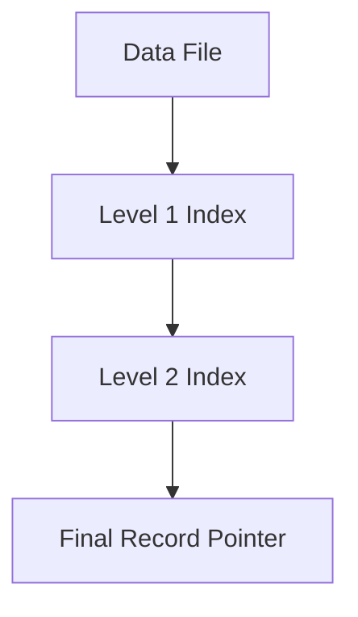

## 📘 Indexing in DBMS
```
       +--------------------+----------------------+
       |     Search Key     |    Data Reference    |
       +--------------------+----------------------+
         ↑                                        ↑
         |                                        |
       Key                                     Value
```
1. 🧠 **Indexing** is used to optimise the performance of a database by minimising the number of disk accesses required when a query is processed.

2. 🗂️ The **index is a type of data structure**. It is used to locate and access the data in a database table quickly.

3. ⚡ **Speeds up operation** with read operations like `SELECT` queries, `WHERE` clause etc.

4. 🔍 **Search Key**: Contains copy of primary key or candidate key of the table or something else.

5. 📍 **Data Reference**: Pointer holding the address of disk block where the value of the corresponding key is stored.

6. ❗ Indexing is **optional**, but increases access speed. It is **not the primary** mean to access the tuple, it is the **secondary** mean.

7. 📁 **Index file is always sorted**.

---

### 🧭 Indexing Methods

#### 1. 📌 Primary Index (Clustering Index)

* A file may have several indices on different search keys.
* If the data file containing the records is sequentially ordered, a **Primary Index** is an index whose **search key also defines the sequential order** of the file.
* ⚠️ **NOTE**: The term *primary index* is sometimes used to mean an index on a **primary key**. However, such usage is nonstandard and should be avoided.
* All files are ordered sequentially on some search key. It could be **Primary Key** or **non-primary key**.

---

#### 📊 Dense vs Sparse Index

| Type            | Description                                                               | Storage                 | Access Speed        |
| --------------- | ------------------------------------------------------------------------- | ----------------------- | ------------------- |
| 🧱 Dense Index  | Contains an index record for **every** search key value in the data file. | Requires **more space** | Faster for lookups  |
| 🪶 Sparse Index | Index record appears for **some** of the search-key values only.          | **Less space** needed   | May take more steps |

##### 🧱 Dense Index

1. The dense index contains an **index record for every search key value** in the data file.
2. The index record contains the **search-key value** and a **pointer to the first data record** with that search-key value.
3. Needs **more space** to store index record itself.

##### 🪶 Sparse Index

1. An index record appears for **only some** of the search-key values.
2. Helps resolve the issues of dense indexing.
3. A **range** of index columns stores the **same data block address**. On retrieval, the block address will be fetched.

---

### 🧮 Primary Indexing Based On:

#### ✅ Key Attribute

* Data file is **sorted w\.r.t primary key attribute**.
* **Primary Key** is used as search key in index.
* **Sparse Index** will be formed:

  ```
  No. of entries in index file = No. of blocks in data file
  ```

#### 📌 Non-Key Attribute

* Data file is **sorted w\.r.t non-key attribute**.
* No. of entries in the index = **unique non-key attribute values**.
* This is a **Dense Index**, as all unique values have an entry.
* **Example**:

  > Let’s assume that a company recruited many employees in various departments.
  > In this case, clustering indexing in DBMS should be created for all employees who belong to the **same dept**.

---

### 🗂️ Multi-level Index

1. Index with **two or more levels**.
2. If the **single-level index becomes too large**, binary search takes time.
3. We can break indexing into **multiple levels** for efficiency.



---

### 🧷 2. Secondary Index (Non-Clustering Index)

1. 📉 Datafile is **unsorted** → **Primary indexing not possible**.
2. Can be done on **key or non-key** attribute.
3. Called **secondary indexing** because normally one indexing is already applied.
4. No. of entries in index file = **no. of records** in data file.
5. 📌 It's an example of **Dense Index**.

---

### ✅ Advantages of Indexing

1. ⚡ Faster access and retrieval of data.
2. 🔁 Less I/O operations.

---

### ❌ Limitations of Indexing

1. 🗃️ **Additional space** required to store the index table.
2. ⛔ **Performance decreases** in `INSERT`, `DELETE`, and `UPDATE` queries.

---

> 🧑‍🏫 **CodeHelp Tip**: Use indexing wisely! Ideal when read operations outweigh writes.

```
+------------------+        +----------------+        +-----------------+
|   Outer Index    | --->   |  Index Block 0 | --->   |   Data Block 0  |
|------------------|        +----------------+        +-----------------+
| Index Block 1 --->         |  Index Block 1 | --->   |   Data Block 1  |
|                          +----------------+        +-----------------+
|                          |   ...          |        |   ...           |
+------------------+        +----------------+        +-----------------+
                           (Inner Index)              (Actual Data)

```
```
                 ┌────────────────────┐
                 │    Outer Index     │
                 └────────┬───────────┘
                          │
              ┌───────────┴────────────┐
              ▼                        ▼
     ┌─────────────────┐      ┌─────────────────┐
     │   Index Block 0 │      │   Index Block 1 │
     │  (Inner Index)  │      │  (Inner Index)  │
     └───────┬─────────┘      └───────┬─────────┘
             │                        │
     ┌───────┴───────┐        ┌───────┴───────┐
     ▼               ▼        ▼               ▼
┌──────────┐   ┌──────────┐ ┌──────────┐   ┌──────────┐
│ DataBlk0 │   │ DataBlk1 │ │ DataBlk2 │   │ DataBlk3 │
└──────────┘   └──────────┘ └──────────┘   └──────────┘

         📘 Two-Level Sparse Index Structure

```