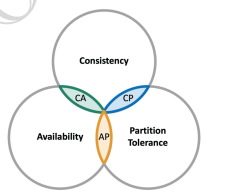

## 🧠 **CAP Theorem**

---

#### 📌 1. Basic and one of the most important concept in Distributed Databases.

#### 📌 2. Useful to know this to design efficient distributed system for your given business logic.

---

### 🔍 3. Let’s first breakdown **CAP**:

#### 📘 1. **Consistency** ✅

In a consistent system, all nodes see the same data simultaneously.

* If we perform a read operation on a consistent system, it should return the value of the **most recent write operation**.
* The read should cause all nodes to return the same data.
* All users see the same data at the same time, regardless of the node they connect to.
* When data is written to a single node, it is then replicated across the other nodes in the system.

---

#### 🔁 2. **Availability** 🟢

When availability is present in a distributed system, it means that the system remains **operational all of the time**.

* Every request will get a response regardless of the individual state of the nodes.
* This means that the system will operate even if there are multiple nodes down.
* ❗Unlike a consistent system, there’s **no guarantee** that the response will be the most recent write operation.

---

#### 🌐 3. **Partition Tolerance** 🔗

When a distributed system encounters a **partition**, it means that there’s a break in communication between nodes.

* If a system is partition-tolerant, the system does **not fail**, regardless of whether messages are dropped or delayed between nodes within the system.
* To have partition tolerance, the system must **replicate records** across combinations of nodes and networks.

---

### 📣 4. What does the **CAP Theorem** say?

> The CAP theorem states that a **distributed system** can only provide **two of three** properties simultaneously:
> ✅ **Consistency**, ✅ **Availability**, and ✅ **Partition Tolerance**.
>
> The theorem formalises the **tradeoff between consistency and availability** when there’s a partition.

---

### 🗃️ 5. CAP Theorem & NoSQL Databases

NoSQL databases are great for **distributed networks**.
They allow for **horizontal scaling**, and they can quickly scale across multiple nodes.
When deciding which NoSQL database to use, it’s important to keep the **CAP theorem** in mind.

---

#### 📊 CAP Database Types Comparison

| **Type** | **Supports**                       | **Does Not Support**  | **Example DBs**     | **Use Case**                      |
| -------- | ---------------------------------- | --------------------- | ------------------- | --------------------------------- |
| **CA**   | Consistency + Availability         | ❌ Partition Tolerance | MySQL, PostgreSQL   | Strong consistency; single region |
| **CP**   | Consistency + Partition Tolerance  | ❌ Availability        | MongoDB             | Banking & critical systems        |
| **AP**   | Availability + Partition Tolerance | ❌ Consistency         | Cassandra, DynamoDB | Social media, real-time apps      |

---

#### 🔷 1. **CA Databases**

* CA databases enable **consistency and availability** across all nodes.
* ❌ Unfortunately, CA databases **can’t deliver fault tolerance**.
* In any distributed system, **partitions are bound to happen**, which means this type of database isn’t a very practical choice.
* That being said, you still can find a CA database if you need one.
* Some relational databases, such as **MySQL** or **PostgreSQL**, allow for **consistency and availability**.
* You can deploy them to nodes using replication.

---

#### 🔷 2. **CP Databases**

* CP databases enable **consistency and partition tolerance**, but not **availability**.
* When a partition occurs, the system has to **turn off inconsistent nodes** until the partition can be fixed.
* **MongoDB** is an example of a CP database.
* It’s a **NoSQL DBMS** that uses **documents** for data storage.
* It’s considered **schema-less**, doesn’t require a defined DB schema.
* Commonly used in **big data and distributed applications**.

> In **MongoDB**, there's only **one primary node** that handles writes.
> Secondaries replicate this data. If the primary fails, a **secondary takes over**.
>
> 💡 In a **banking system**, availability is not as important as consistency, so **CP is preferred**.

---

#### 🔷 3. **AP Databases**

* AP databases enable **availability and partition tolerance**, but not **consistency**.
* In the event of a partition, all nodes are **available**, but they’re **not all updated**.
* For example, if a user accesses a **bad node**, they might not receive the **most recent data**.
* Once the partition is resolved, **nodes sync** to ensure consistency.
* **Apache Cassandra** is a good example.
* It’s a NoSQL database with **no primary node** — all nodes remain available.
* Allows for **eventual consistency** as users can re-sync after partition recovery.

> 💬 For apps like **Facebook**, we value **availability** more than consistency, so we’d opt for **AP Databases** like **Cassandra** or **Amazon DynamoDB**.

---

### 📦 Summary Diagram (Textual Representation)

```
CAP Theorem Triangle:
       [Consistency]
          /     \
         /       \
  [Availability] - [Partition Tolerance]
Pick any two ✅
```

---
