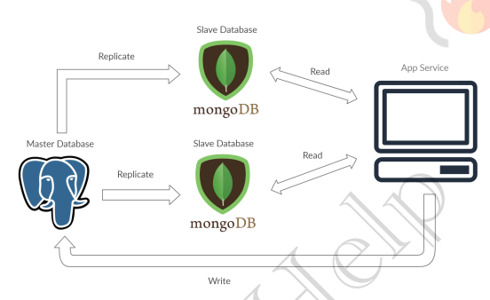

## 🧠 **The Master-Slave Database Concept**

```
                     ┌───────────────────────┐
                     │    Slave Database     │
                     │       mongoDB         │
                     └─────────▲─────────────┘
                               │
                          Read │
                               │
        ┌──────────────┐       │       ┌───────────────┐
        │              │───────┘──────▶│               │
        │  Master DB   │  Replicate    │  App Service  │
        │ (PostgreSQL) │──────────────▶│               │
        │              │               └───────────────┘
        └─────▲────────┘                     ▲
              │                              │
              │ Replicate                    │ Write
              │                              │
        ┌─────┴────────┐                     │
        │              │◀────────────────────┘
        │  Slave DB    │
        │  mongoDB     │
        └──────────────┘

```
---

### 🔧 1. Introduction

Master-Slave is a general way to optimise **I/O in a system** where the number of requests goes way high that a single DB server is not able to handle it efficiently.

---

### 🧩 2. Pattern Reference

It’s a **Pattern 3** in LEC-19 (**Database Scaling Pattern**):
🎯 *Command Query Responsibility Segregation (CQRS)*

---

### 🗃️ 3. Role-Based Operations

* The **true or latest data** is kept in the **Master DB**, so ➕ *write operations* are directed there.
* ✅ *Read operations* are served **only from Slaves**.

This architecture helps in:

| ✅ Feature           | 💡 Benefit                                 |
| ------------------- | ------------------------------------------ |
| 🔒 Site Reliability | Prevents crashes due to overload           |
| 🌐 Availability     | Users experience minimal downtime          |
| ⚡ Low Latency       | Read requests are served faster via slaves |

> 📉 If a site receives a lot of traffic and the only available database is one master, it will be overloaded with both reading and writing requests.
> 😖 This makes the **entire system slow** for everyone on the site.

---

### 🔁 4. Replication Mechanism

DB replication will take care of distributing data from **Master machine to Slave machines**.

Replication can be:

| 🔄 Type of Replication | 🔍 Description                                       |
| ---------------------- | ---------------------------------------------------- |
| ⏱️ Synchronous         | Waits for slave to confirm before committing a write |
| 🕐 Asynchronous        | Master does not wait; faster but risk of stale reads |

---

### 🔥 Bonus: Master-Slave vs. Single DB

| Feature             | Single DB 🗄️          | Master-Slave DB 🧬             |
| ------------------- | ---------------------- | ------------------------------ |
| Scalability         | ❌ Limited              | ✅ Scales with number of slaves |
| Reliability         | ❌ One point of failure | ✅ Multiple replicas for reads  |
| Write Load Handling | ✅ Full capacity        | ✅ Centralized in Master        |
| Read Load Handling  | ❌ Bottlenecked         | ✅ Distributed across Slaves    |

---

### 🧪 Code Hint (Conceptual Only – Pseudocode)

```sql
-- Write Operation (To Master)
INSERT INTO users VALUES (...); -- goes to Master DB

-- Read Operation (From Slaves)
SELECT * FROM users WHERE id = 101; -- hits any Slave DB
```

---

✅ **Summary**:

> Master-Slave is a **read-optimized** scaling pattern. Master handles **writes**, Slaves handle **reads**.
> Replication ensures **data consistency**, **low latency**, and **high availability** depending on sync type.

---

