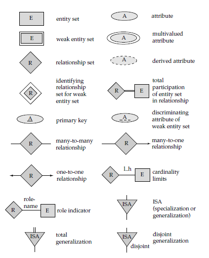

## 📚 Entity-Relationship Model

---

### 🔧 1. Data Model

A **Data Model** is a collection of conceptual tools for:

* Describing data
* Data relationships
* Data semantics
* Consistency constraints

---

### 🧩 2. ER Model

1. It is a **high-level data model** based on a perception of a real world that consists of a collection of basic objects, called **entities**, and of **relationships** among these objects.
2. Graphical representation of ER Model is **ER diagram**, which acts as a **blueprint of DB**.

---

### 🧱 3. Entity

* An **Entity** is a “thing” or “object” in the real world that is distinguishable from all other objects.

  * ✅ It has **physical existence**.
  * ✅ Each student in a college is an entity.
  * ✅ Entity can be **uniquely identified** (by a primary attribute, aka **Primary Key**).

#### ⚡ Entity Types

| Type              | Description                                                            |
| ----------------- | ---------------------------------------------------------------------- |
| **Strong Entity** | Can be uniquely identified.                                            |
| **Weak Entity**   | Can’t be uniquely identified, depends on some other **strong entity**. |

* **Weak Entity Characteristics:**

  1. It doesn’t have sufficient attributes to select a uniquely identifiable attribute.
  2. Example: `Loan` → Strong Entity, `Payment` → Weak (as instalments are sequential number counter generated separately for each loan).
  3. Weak entity depends on strong entity for existence.

---

### 🗃️ 4. Entity Set

1. It is a set of **entities of the same type** that share the same **properties or attributes**.
2. E.g., `Student` is an entity set.
3. E.g., `Customer` of a bank.

---

### 🔑 5. Attributes

1. An entity is represented by a set of **attributes**.
2. Each entity has a **value for each of its attributes**.
3. For each attribute, there is a set of **permitted values**, called the **domain** or **value set** of that attribute.
4. E.g., Student Entity has the following attributes:

   * Student\_ID
   * Name
   * Standard
   * Course
   * Batch
   * Contact number
   * Address

#### 🧬 Types of Attributes

| Type              | Description                                                                                     | Example                                          |
| ----------------- | ----------------------------------------------------------------------------------------------- | ------------------------------------------------ |
| **Simple**        | Attributes which can’t be divided further                                                       | Customer’s account number, Student’s Roll number |
| **Composite**     | Can be divided into subparts                                                                    | Name → first-name, middle-name, last-name        |
| **Single-valued** | Only one value attribute                                                                        | Student ID, loan-number                          |
| **Multi-valued**  | Attribute having more than one value                                                            | phone-number, nominee-name, dependent-name       |
| **Derived**       | Value derived from other related attributes                                                     | Age, loan-age, membership-period                 |
| **NULL Value**    | Attribute takes null when an entity has no value for it; can mean "not applicable" or "unknown" | No middle-name, missing name, unknown salary     |

---

### 🔗 6. Relationships

1. **Association among two or more entities.**
2. E.g., `Person has vehicle`, `Parent has Child`, `Customer borrow loan` etc.
3. **Strong Relationship:** Between two independent entities.
4. **Weak Relationship:** Between weak entity and its owner/strong entity.

   * E.g., `Loan` <instalment-payments> `Payment`.

#### 🔁 Degree of Relationship

| Degree      | Participants   | Example                      |
| ----------- | -------------- | ---------------------------- |
| **Unary**   | One entity     | Employee manages employee    |
| **Binary**  | Two entities   | Student takes Course         |
| **Ternary** | Three entities | Employee works-on branch/job |

ℹ️ Binary relationships are **most common**.

---

### 📐 7. Relationship Constraints

#### 🔢 Mapping Cardinality / Cardinality Ratio

Defines how many entities can be associated with another entity via a relationship.

| Type             | Description                       | Example                                       |
| ---------------- | --------------------------------- | --------------------------------------------- |
| **One-to-One**   | A ↔ B (both sides max one)        | Citizen has Aadhar Card                       |
| **One-to-Many**  | A → B (A to many B, B to one A)   | Citizen has Vehicle                           |
| **Many-to-One**  | A → B (A to one B, B to many A)   | Course taken by Professor                     |
| **Many-to-Many** | A → B and B → A (both sides many) | Customer buys product, Student attends course |

#### 🧯 Participation Constraints

Also known as **Minimum cardinality constraint**.

| Type                      | Description                                                       | Example                                                     |
| ------------------------- | ----------------------------------------------------------------- | ----------------------------------------------------------- |
| **Partial Participation** | Not all entities involved in the relationship                     | Customer borrows loan → customer has partial participation  |
| **Total Participation**   | Each entity **must** be involved in **at least one** relationship | Loan entity must be borrowed → loan has total participation |

✅ **Note:** Weak entities have **total participation** constraints, but strong entities may **not**.

---

### 🧾 8. ER Notations

---