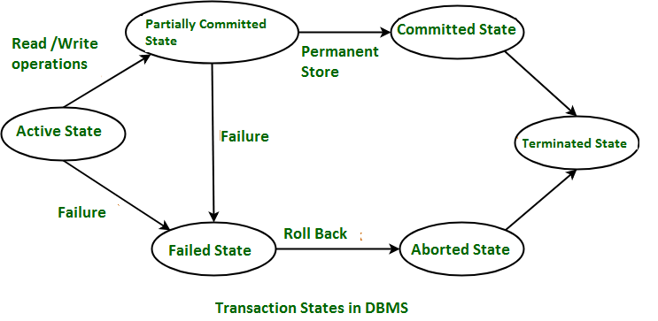

## Transaction

---

### 🔄 1. Transaction

* **A unit of work done against the DB in a logical sequence.**
* **Sequence is very important in transaction.**
* **It is a logical unit of work that contains one or more SQL statements.**
  The result of all these statements in a transaction either gets completed successfully (all the changes made to the database are permanent) or if at any point any failure happens it gets rollbacked (all the changes being done are undone).

---

### 🛡️ 2. ACID Properties

To ensure integrity of the data, we require that the DB system maintain the following properties of the transaction:

| Property                                                                                     | Definition                                                                                                                                                                                                                                                                                                                                       |
| -------------------------------------------------------------------------------------------- | ------------------------------------------------------------------------------------------------------------------------------------------------------------------------------------------------------------------------------------------------------------------------------------------------------------------------------------------------ |
| **Atomicity**                                                                                | Either all operations of transaction are reflected properly in the DB, or none are.                                                                                                                                                                                                                                                              |
| **Consistency**                                                                              | Integrity constraints must be maintained before and after transaction.                                                                                                                                                                                                                                                                           |
| DB must be consistent after transaction happens.                                             |                                                                                                                                                                                                                                                                                                                                                  |
| **Isolation**                                                                                | Even though multiple transactions may execute concurrently, the system guarantees that, for every pair of transactions Ti and Tj, it appears to Ti that either Tj finished execution before Ti started, or Tj started execution after Ti finished. Thus, each transaction is unaware of other transactions executing concurrently in the system. |
| Multiple transactions can happen in the system in isolation, without interfering each other. |                                                                                                                                                                                                                                                                                                                                                  |
| **Durability**                                                                               | After transaction completes successfully, the changes it has made to the database persist, even if there are system failures.                                                                                                                                                                                                                    |

---

#### 🖼️ ASCII Illustration of ACID

```
           +-------------+-------------------------------------------+
           |  Property   | Guarantee                                 |
           +-------------+-------------------------------------------+
           | Atomicity   | All-or-nothing: commit or rollback        |
           +-------------+-------------------------------------------+
           | Consistency | DB moves from one valid state to another   |
           +-------------+-------------------------------------------+
           | Isolation   | Concurrent txns appear as if serialised   |
           +-------------+-------------------------------------------+
           | Durability  | Committed changes survive system failures |
           +-------------+-------------------------------------------+
```

---

### ⚙️ 3. Transaction States



1. **Active state**
   The very first state of the life cycle of the transaction, all the read and write operations are being performed. If they execute without any error the T comes to Partially committed state. Although if any error occurs then it leads to a Failed state.

2. **Partially committed state**
   After transaction is executed the changes are saved in the buffer in the main memory. If the changes made are permanent on the DB then the state will transfer to the committed state and if there is any failure, the T will go to Failed state.

3. **Committed state**
   When updates are made permanent on the DB. Then the T is said to be in the committed state. Rollback can’t be done from the committed state. New consistent state is achieved at this stage.

4. **Failed state**
   When T is being executed and some failure occurs. Due to this it is impossible to continue the execution of the T.

5. **Aborted state**
   When T reaches the failed state, all the changes made in the buffer are reversed. After that the T rollback completely. T reaches abort state after rollback. DB’s state prior to the T is achieved.

6. **Terminated state**
   A transaction is said to have terminated if it has either committed or aborted.

---

### 💻 Example SQL Code

```sql
-- Start a transaction
BEGIN TRANSACTION;

-- Debit account 1
UPDATE Accounts
SET balance = balance - 100
WHERE id = 1;

-- Credit account 2
UPDATE Accounts
SET balance = balance + 100
WHERE id = 2;

-- If all statements succeed, make changes permanent
COMMIT;

-- On error, rollback all changes
ROLLBACK;
```

---

### 🔍 Key Comparison: ACID vs. BASE

| Aspect        | ACID                                        | BASE                                                       |
| ------------- | ------------------------------------------- | ---------------------------------------------------------- |
| **Approach**  | Strict consistency and isolation            | Basically Available, Soft state, Eventual consistency      |
| **Use-case**  | Financial systems, banking                  | Large-scale distributed systems (e.g., social media feeds) |
| **Trade-off** | May sacrifice availability under contention | Sacrifices immediate consistency for higher availability   |

---

> **✅ Takeaways**
>
> * Transactions group SQL statements into an all-or-nothing unit.
> * ACID ensures **A**tomicity, **C**onsistency, **I**solation, **D**urability.
> * Transactions pass through six states: Active → Partially Committed → Committed → Failed → Aborted → Terminated.
> * Use `COMMIT` to persist or `ROLLBACK` to undo based on success/failure.
