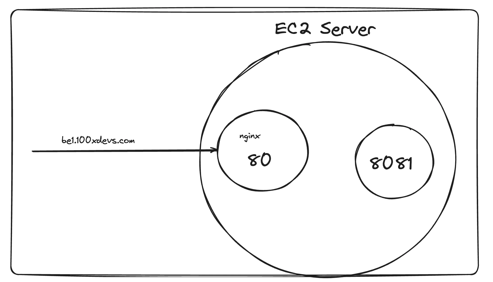

# Untitled

# **Step 1 - What is AWS**


AWS is Amazon’s `cloud` service.

It let’s you

1. Rent servers
2. Manage domains
3. Upload objects (mp4 files, jpgs, mp3s …)
4. Autoscale servers
5. Create k8s clusters

…

The offering we will be focussing on today is `Renting servers`

# **Step 2 - EC2 servers**

VMs on AWS are called `EC2 Servers`

EC2 stands for Elastic compute Version 2.

1. `Elastic` - Can increase/decrease the size of the machine
2. `Compute` - It is a machine

You can spin up a new EC2 instance from the aws dashboard


# **Step 3 - Creating a new EC2 server**

1. Click on `Launch a new instance`

2. Give a name 

3. Select an OS

4. Select size

5. Create a new Key pair

6. Select Size

7. Allow traffic on http/https


# **Step 4 - SSH into server**

### **1. Give ssh key permissions**

```jsx
chmod 700 kirat-class.pem
```

### **2. ssh into machine**

```jsx
ssh -i kirat-class.pem ubuntu@ec2-65-0-180-32.ap-south-1.compute.amazonaws.com
```

### **3. Clone repo**

```jsx
git clone https://github.com/hkirat/sum-server
```

💡

If your aws machine shows you the following error, your aws machine doesn’t have access to the internet

Solution - [https://www.tecmint.com/resolve-temporary-failure-in-name-resolution/](https://www.tecmint.com/resolve-temporary-failure-in-name-resolution/)


### **4. Install Node.js**

💡

[https://www.digitalocean.com/community/tutorials/how-to-install-node-js-on-ubuntu-20-04](https://www.digitalocean.com/community/tutorials/how-to-install-node-js-on-ubuntu-20-04)

### **5. Install all dependencies**

```jsx
cd sum-server
npm install
```

### **6. Start backend**

```jsx
node index.js
```

# **Step 5 - Install the repo**

Clone the repo

```jsx
https://github.com/hkirat/sum-server
```

# **Step 6 - Try hitting the server**

You have an ip/DNS that you can hit to access your ec2 server


### **Try visiting the backend**

```jsx
your_domain:3000
```

Notice you `can’t` visit the website during this time


### **Security group**


You can either open port 8080, or process on port `80`


```jsx
http://your_domain:8080
```

# **Step 7 - nginx**

[https://www.nginx.com/resources/glossary/nginx/](https://www.nginx.com/resources/glossary/nginx/)


### **What is a reverse proxy?**


### **Installing nginx**

```jsx
sudo apt update
sudo apt install nginx
```

This should start a `nginx server` on port 80

Try visiting the website


### **Create reverse proxy**

```jsx
sudo rm sudo vi /etc/nginx/nginx.conf
sudo vi /etc/nginx/nginx.conf
```

```jsx
events {
    # Event directives...
}

http {
	server {
    listen 80;
    server_name be1.100xdevs.com;

    location / {
        proxy_pass http://localhost:8080;
        proxy_http_version 1.1;
        proxy_set_header Upgrade $http_upgrade;
        proxy_set_header Connection 'upgrade';
        proxy_set_header Host $host;
        proxy_cache_bypass $http_upgrade;
    }
	}
}
```

```jsx
sudo nginx -s reload
```

### **Start the Backend server**

```jsx
node index.js
```

### **Visit the website**

```jsx
https://be1.100xdevs.com/
```


# **Step 8 - Certificate management**

Use [https://certbot.eff.org/](https://certbot.eff.org/)