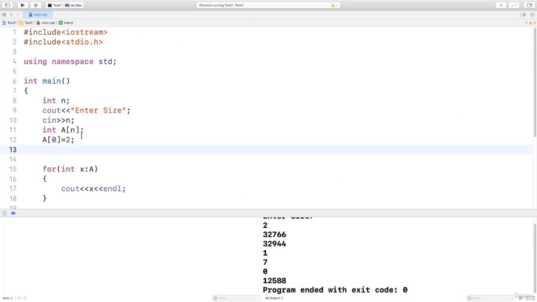
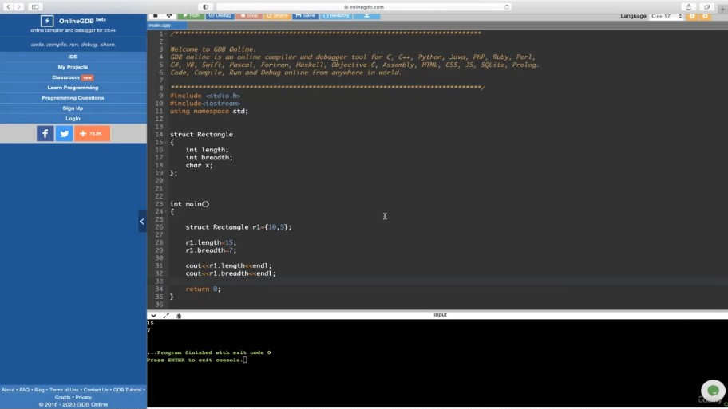
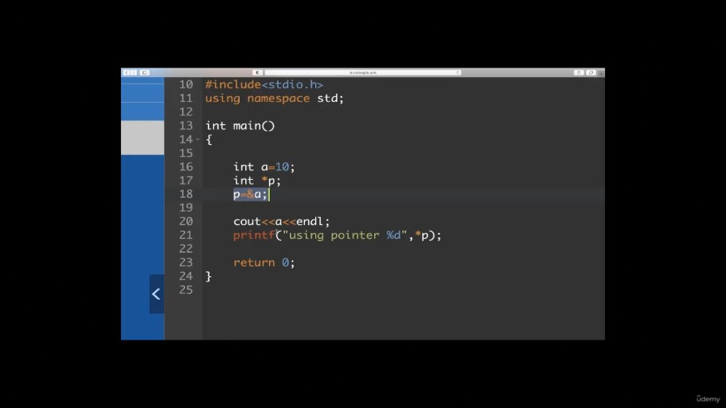
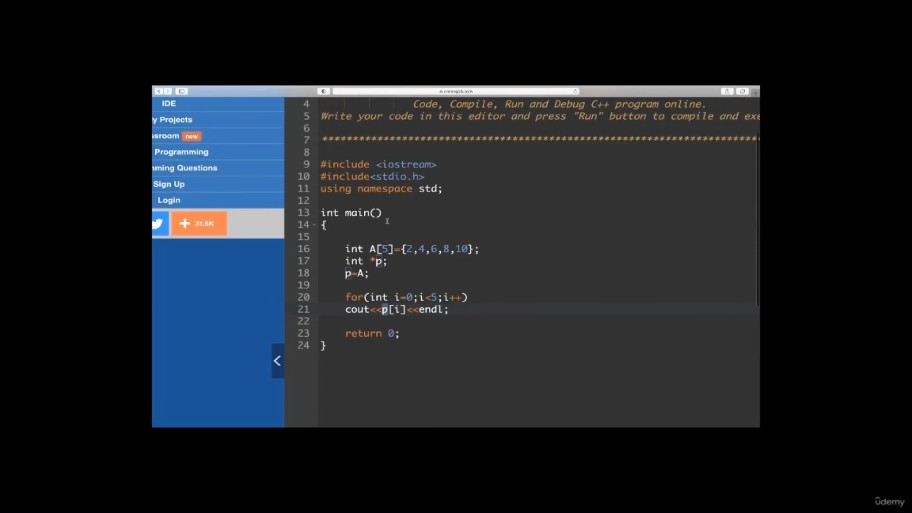
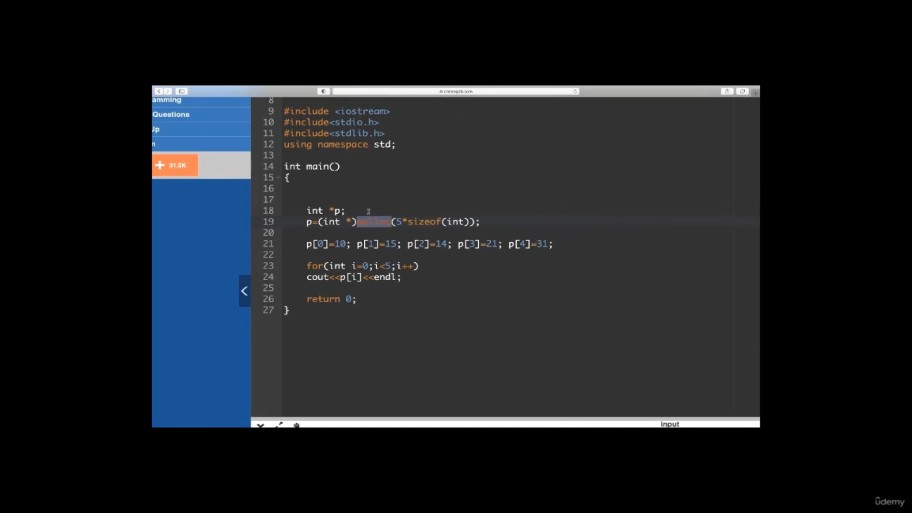
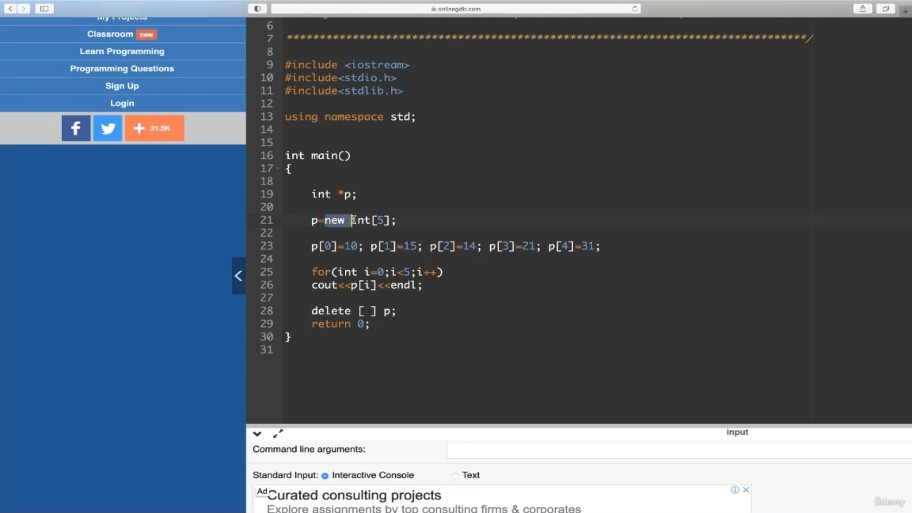
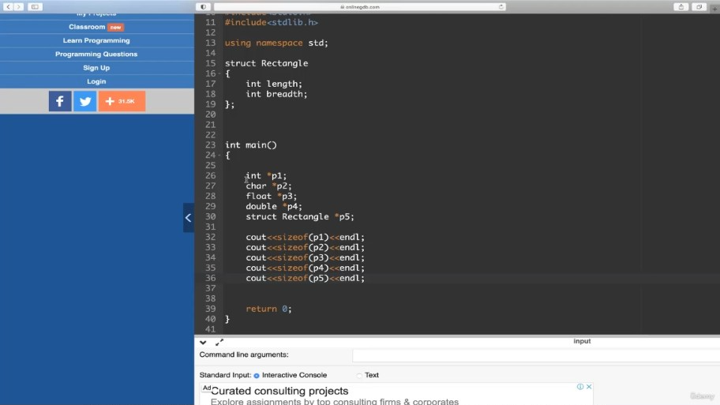
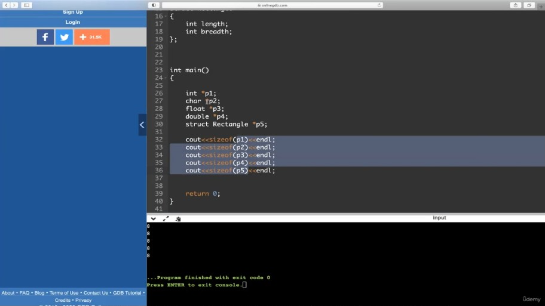

# Essential C and CPP Concepts

## Table of Contents
- [Essential C and CPP Concepts](#essential-c-and-cpp-concepts)
  - [Table of Contents](#table-of-contents)
  - [📘 Arrays (Basics \& Memory Representation)](#-arrays-basics--memory-representation)
    - [🔹 Overview](#-overview)
    - [🔹 Concepts Explained](#-concepts-explained)
      - [✅ What is an Array?](#-what-is-an-array)
      - [✅ Array Indexing](#-array-indexing)
      - [✅ Memory Allocation](#-memory-allocation)
      - [✅ Declaration and Initialization](#-declaration-and-initialization)
      - [✅ Accessing Array Elements](#-accessing-array-elements)
    - [🔹 Definitions](#-definitions)
    - [🔹 Diagrams or Described Visuals](#-diagrams-or-described-visuals)
    - [🔹 Time and Space Complexities](#-time-and-space-complexities)
    - [🔹 Code Examples](#-code-examples)
    - [🔹 Instructor Tips or Mnemonics](#-instructor-tips-or-mnemonics)
    - [🔹 Interview-Style Questions](#-interview-style-questions)
    - [🔹 Final Takeaways](#-final-takeaways)
  - [📘 Arrays – Practical Concepts \& Demonstration (Self-Study Notes)](#-arrays--practical-concepts--demonstration-self-study-notes)
    - [🛠️ Development Setup](#️-development-setup)
    - [🔢 What is an Array?](#-what-is-an-array-1)
      - [📌 Declaration:](#-declaration)
    - [🧠 Understanding Indexing \& Memory](#-understanding-indexing--memory)
    - [🧾 C vs C++ Syntax for Output](#-c-vs-c-syntax-for-output)
    - [🧮 Array Initialization Methods](#-array-initialization-methods)
      - [1. **Explicit Initialization**](#1-explicit-initialization)
      - [2. **Omit Size (auto-detect)**](#2-omit-size-auto-detect)
      - [3. **Partial Initialization**](#3-partial-initialization)
      - [4. **Single Zero Initialization**](#4-single-zero-initialization)
    - [🔁 Accessing Arrays](#-accessing-arrays)
      - [1. **Using `for` loop**](#1-using-for-loop)
      - [2. **Using C++ For-each loop**](#2-using-c-for-each-loop)
    - [🧾 Variable Size Arrays (VLA)](#-variable-size-arrays-vla)
      - [Input-based array size:](#input-based-array-size)
      - [⚠️ Limitations:](#️-limitations)
      - [Alternative:](#alternative)
    - [🧹 Important Notes](#-important-notes)
    - [✅ Key Takeaways](#-key-takeaways)
  - [📘 Structures in C/C++ – Self-Study Notes](#-structures-in-cc--self-study-notes)
    - [📌 What is a Structure?](#-what-is-a-structure)
    - [💡 Why Use Structures?](#-why-use-structures)
    - [🧱 Structure Syntax](#-structure-syntax)
      - [✅ Definition](#-definition)
      - [✅ Declaration](#-declaration-1)
      - [✅ Declaration + Initialization](#-declaration--initialization)
    - [🔧 Accessing Structure Members](#-accessing-structure-members)
    - [🧠 Memory Consideration](#-memory-consideration)
    - [🧑‍🎓 Example Use Cases](#-example-use-cases)
      - [1. ✅ **Complex Number**](#1--complex-number)
      - [2. ✅ **Student Info**](#2--student-info)
      - [3. ✅ **Playing Card**](#3--playing-card)
    - [📚 Array of Structures](#-array-of-structures)
      - [Accessing Elements:](#accessing-elements)
    - [🛠️ Key Points](#️-key-points)
    - [🧠 Next Topics (Preview)](#-next-topics-preview)
  - [📘 Structures in C/C++ (Demo \& Explanation)](#-structures-in-cc-demo--explanation)
  - [](#)
    - [✅ Clear Definitions](#-clear-definitions)
    - [🎯 Why / When to Use](#-why--when-to-use)
    - [💻 Code Examples](#-code-examples-1)
      - [🔹 Defining and Declaring a Structure](#-defining-and-declaring-a-structure)
      - [🔹 Defining + Declaring Together](#-defining--declaring-together)
      - [🔹 Initializing Members](#-initializing-members)
      - [🔹 Accessing Members](#-accessing-members)
      - [🔹 Changing Member Values](#-changing-member-values)
      - [🔹 Calculating Size of Structure](#-calculating-size-of-structure)
    - [📊 Structure Memory Layout \& Padding](#-structure-memory-layout--padding)
    - [🧠 Memory / Execution Explanation](#-memory--execution-explanation)
    - [⚠️ Common Mistakes / Warnings](#️-common-mistakes--warnings)
    - [📦 Key Takeaways](#-key-takeaways-1)
  - [📘 Pointers in C/C++ (Definition, Memory, Initialization, and Heap Allocation)](#-pointers-in-cc-definition-memory-initialization-and-heap-allocation)
    - [✅ Clear Definitions](#-clear-definitions-1)
    - [🎯 Why / When to Use Pointers](#-why--when-to-use-pointers)
    - [💻 Code Examples](#-code-examples-2)
      - [🔹 Basic Pointer Usage](#-basic-pointer-usage)
      - [🔹 Accessing Heap Memory (C Style)](#-accessing-heap-memory-c-style)
      - [🔹 Accessing Heap Memory (C++ Style)](#-accessing-heap-memory-c-style-1)
    - [📊 Declaration, Initialization \& Dereferencing Summary](#-declaration-initialization--dereferencing-summary)
    - [🧠 Memory / Execution Explanation](#-memory--execution-explanation-1)
      - [🔸 Memory Sections](#-memory-sections)
    - [⚠️ Common Mistakes / Warnings](#️-common-mistakes--warnings-1)
    - [📦 Key Takeaways](#-key-takeaways-2)
  - [📘 Pointer Demonstration in C/C++](#-pointer-demonstration-in-cc)
    - [✅ Clear Definitions](#-clear-definitions-2)
    - [🎯 Why / When to Use](#-why--when-to-use-1)
    - [💻 Code Examples](#-code-examples-3)
      - [🔹 Basic Pointer Demo](#-basic-pointer-demo)
      - [🔹 Accessing Address vs. Value](#-accessing-address-vs-value)
      - [🔹 Pointer to an Array](#-pointer-to-an-array)
      - [🔹 Heap Memory Allocation](#-heap-memory-allocation)
        - [C Style:](#c-style)
        - [C++ Style:](#c-style-1)
      - [🔹 Assigning Heap Array Values](#-assigning-heap-array-values)
      - [🔹 Deallocating Heap Memory](#-deallocating-heap-memory)
    - [📊 Table: Pointer Declaration, Initialization, Dereferencing](#-table-pointer-declaration-initialization-dereferencing)
    - [📊 Table: Pointer vs Variable Memory Allocation](#-table-pointer-vs-variable-memory-allocation)
    - [📊 Pointer Sizes (Very Important)](#-pointer-sizes-very-important)
    - [🧠 Memory / Execution Explanation](#-memory--execution-explanation-2)
    - [⚠️ Common Mistakes / Warnings](#️-common-mistakes--warnings-2)
    - [📦 Key Takeaways](#-key-takeaways-3)
  - [Reference in C++](#reference-in-c)
    - [🧠 **Clear Definition**](#-clear-definition)
    - [❓ **Why / When to Use References**](#-why--when-to-use-references)
    - [🧾 **Syntax + Code Example**](#-syntax--code-example)
    - [📊 **Memory / Execution Explanation**](#-memory--execution-explanation-3)
    - [⚠️ **Common Mistakes / Warnings**](#️-common-mistakes--warnings-3)
    - [📦 **Key Takeaways Box**](#-key-takeaways-box)
  - [Demonstration of Reference in C++](#demonstration-of-reference-in-c)
    - [🧠 **Clear Definition Recap**](#-clear-definition-recap)
    - [🧾 **Syntax Reminder**](#-syntax-reminder)
    - [✅ **Live Coding Walkthrough**](#-live-coding-walkthrough)
    - [🧩 **Reference vs Variable vs Pointer**](#-reference-vs-variable-vs-pointer)
    - [🧠 **Memory / Execution Clarification**](#-memory--execution-clarification)
    - [⚠️ **Common Mistakes / Warnings**](#️-common-mistakes--warnings-4)
    - [📦 **Key Takeaways Box**](#-key-takeaways-box-1)
  - [Pointer to a Structure in C / C++](#pointer-to-a-structure-in-c--c)
    - [🧠 **Clear Definition**](#-clear-definition-1)
    - [❓ **Why / When to Use It**](#-why--when-to-use-it)
    - [🧾 **Code Examples**](#-code-examples-4)
      - [✅ **Syntax 1: Pointer to an Existing Structure (Static Allocation)**](#-syntax-1-pointer-to-an-existing-structure-static-allocation)
      - [✅ **Syntax 2: Pointer to a Dynamically Allocated Structure (Heap Allocation)**](#-syntax-2-pointer-to-a-dynamically-allocated-structure-heap-allocation)
    - [📊 **Table: Dot (.) vs Arrow (-\>)**](#-table-dot--vs-arrow--)
    - [🧠 **Memory / Execution Notes**](#-memory--execution-notes)
    - [⚠️ **Common Mistakes / Warnings**](#️-common-mistakes--warnings-5)
    - [📦 **Key Takeaways Box**](#-key-takeaways-box-2)
  - [Pointer to a Structure – Demonstration with C and C++](#pointer-to-a-structure--demonstration-with-c-and-c)
    - [🧠 **Clear Definition**](#-clear-definition-2)
    - [❓ **Why / When to Use**](#-why--when-to-use-2)
    - [🧾 **Code Examples (Static + Dynamic + C++ Style)**](#-code-examples-static--dynamic--c-style)
      - [✅ **1. Static Structure + Pointer Access**](#-1-static-structure--pointer-access)
      - [✅ **2. Dynamic Allocation in C Style**](#-2-dynamic-allocation-in-c-style)
      - [✅ **3. Dynamic Allocation in C++ Style (with `new`)**](#-3-dynamic-allocation-in-c-style-with-new)
    - [📊 **Table: C vs C++ Code Style**](#-table-c-vs-c-code-style)
    - [🧠 **Memory \& Execution Notes**](#-memory--execution-notes-1)
    - [⚠️ **Common Mistakes / Gotchas**](#️-common-mistakes--gotchas)
    - [📦 **Key Takeaways Box**](#-key-takeaways-box-3)
  - [Functions in C/C++](#functions-in-cc)
    - [🧠 **Clear Definition**](#-clear-definition-3)
    - [❓ **Why / When to Use Functions**](#-why--when-to-use-functions)
    - [🧱 **Modular Programming vs Monolithic Programming**](#-modular-programming-vs-monolithic-programming)
    - [🧾 **Example: Addition Function**](#-example-addition-function)
      - [✅ Code Snippet](#-code-snippet)
    - [🧩 **Function Terminologies**](#-function-terminologies)
    - [📊 **Memory / Execution Flow**](#-memory--execution-flow)
    - [🧠 **Important Behavior Notes**](#-important-behavior-notes)
    - [📦 **Key Takeaways Box**](#-key-takeaways-box-4)
  - [Function Demonstration in C/C++](#function-demonstration-in-cc)
    - [🧠 **Clear Definition Recap**](#-clear-definition-recap-1)
    - [❓ **Why Use a Function for a Simple Task?**](#-why-use-a-function-for-a-simple-task)
    - [🧾 **Code Demonstration**](#-code-demonstration)
    - [📌 **Step-by-Step Explanation**](#-step-by-step-explanation)
    - [📊 **Terminology Table**](#-terminology-table)
    - [🧠 **Memory / Execution Insight**](#-memory--execution-insight)
    - [⚠️ **Common Mistakes**](#️-common-mistakes)
    - [📦 **Key Takeaways Box**](#-key-takeaways-box-5)

## 📘 Arrays (Basics & Memory Representation)

---

### 🔹 Overview

This chapter introduces the concept of arrays in C/C++. It covers how to declare, initialize, and access arrays, and where arrays are stored in memory. The section serves as a revision of basic C programming skills, essential for understanding future data structure concepts.

---

### 🔹 Concepts Explained

#### ✅ What is an Array?

* An array is a **collection of similar data types**, stored at **contiguous memory locations**.
* It allows grouping multiple values (like integers or floats) under a single name.
* Example: `int A[5];` declares an array of 5 integers.
* each location is if integer then total size of array would be = no. of elements * size of int datatype

#### ✅ Array Indexing

* Array indices start from **0 to n-1** (if size is `n`).
* Example: `A[0] = 27; A[1] = 10;`

#### ✅ Memory Allocation

* Arrays declared **inside a function** are stored in the **stack section** of memory.
* Memory layout of main memory:

  * **Code section**
  * **Stack** → Arrays declared in functions reside here.
  * **Heap**

#### ✅ Declaration and Initialization

* Declaration without initialization:

  ```c
  int A[5];
  ```
* Declaration with initialization:

  ```c
  int B[5] = {2, 9, 6, 8, 10};
  ```

#### ✅ Accessing Array Elements

* Use a `for` loop to iterate through array elements:

  ```c
  for (int i = 0; i < 5; i++) {
      printf("%d ", B[i]);
  }
  ```

---

### 🔹 Definitions

| Term           | Definition                                                             |
| -------------- | ---------------------------------------------------------------------- |
| Array          | Collection of similar data types stored in contiguous memory locations |
| Index          | Position of an element in the array, starting from 0                   |
| Declaration    | Syntax to allocate memory for array without assigning values           |
| Initialization | Assigning values to the array during its declaration                   |

---

### 🔹 Diagrams or Described Visuals

* **Array Visualization**:

  ```
  Index:     0     1     2     3     4
            --------------------------
  Array A: | 27 | 10 |     |     |     |
            --------------------------
  ```

* **Memory Layout**:

  ```
  +-------------------+
  |    Code Section   |
  +-------------------+
  |       Stack       | ← Array A, B stored here
  +-------------------+
  |       Heap        |
  +-------------------+
  ```

---

### 🔹 Time and Space Complexities

| Operation              | Time Complexity | Space Complexity |
| ---------------------- | --------------- | ---------------- |
| Access (A\[i])         | O(1)            | O(1)             |
| Traversal (loop)       | O(n)            | O(1)             |
| Initialization (fixed) | O(n)            | O(n)             |

---

### 🔹 Code Examples

✅ **Declaration and Initialization**:

```c
int A[5];                  // Declaration
int B[5] = {2, 9, 6, 8, 10}; // Initialization
```

✅ **Accessing Array Elements using Loop**:

```c
for (int i = 0; i < 5; i++) {
    printf("%d ", B[i]);
}
```

* This prints: `2 9 6 8 10`

---

### 🔹 Instructor Tips or Mnemonics

* Index starts at **0**, not 1.
* Arrays declared in functions go to the **stack**.
* Always use loops like `for` to access all array elements.

---

### 🔹 Interview-Style Questions

1. What is the time complexity of accessing an element in an array?
2. How are arrays stored in memory in C?
3. Difference between declaration and initialization?
4. Why do array indices start at 0?
5. What section of memory holds arrays declared inside a function?

---

### 🔹 Final Takeaways

* Arrays group similar elements using a single identifier.
* Indexing begins from 0.
* Arrays in functions live in stack memory.
* Declaration and initialization can be done together or separately.
* Loops are essential to access array elements efficiently.

---
Here are **well-structured self-study notes** based on the *“Practice: Arrays Basics”* lecture, written in a way that helps you **revise, understand concepts, and prepare for implementation-based questions**:

---

## 📘 Arrays – Practical Concepts & Demonstration (Self-Study Notes)


### 🛠️ Development Setup

* **IDE Used in Demo**: Xcode on macOS
* **Languages**: C and C++
* **Practice Options**:

  * Local IDE: Xcode, Code::Blocks, Turbo C++, etc.
  * Online Compiler: [https://www.onlinegdb.com](https://www.onlinegdb.com)

    > Select C++ compiler → Preloaded with `main()`, `#include <iostream>` and `using namespace std`.

---

### 🔢 What is an Array?

* Array is a **contiguous block of memory** to store elements of the same data type.
* Accessed via **indexing**, starting from **0**.
* Can be declared and initialized in both C and C++.

#### 📌 Declaration:

```cpp
int A[5]; // Declares an integer array of size 5
```

---

### 🧠 Understanding Indexing & Memory

```cpp
A[0] = 12;
A[1] = 15;
A[2] = 25;
```

* Stores values at respective indices
* Total indices: `0 to size-1` → `A[0]` to `A[4]`
* Memory size = `size * sizeof(int)`
  e.g., If `int = 4 bytes` → `5 * 4 = 20 bytes`

```cpp
cout << sizeof(A); // Outputs 20
```

---

### 🧾 C vs C++ Syntax for Output

| Language | Function   |
| -------- | ---------- |
| C        | `printf()` |
| C++      | `cout`     |

You can mix both in most compilers:

```cpp
cout << A[1] << endl;   // C++ style
printf("%d\n", A[2]);   // C style
```

---

### 🧮 Array Initialization Methods

#### 1. **Explicit Initialization**

```cpp
int A[5] = {2, 4, 6, 8, 10};
```

#### 2. **Omit Size (auto-detect)**

```cpp
int A[] = {2, 4, 6, 8, 10, 12, 14}; // Size is 7
```

#### 3. **Partial Initialization**

```cpp
int A[10] = {2, 4, 6}; // Remaining 7 elements = 0
```

#### 4. **Single Zero Initialization**

```cpp
int A[10] = {0}; // All 10 elements = 0
```

---

### 🔁 Accessing Arrays

#### 1. **Using `for` loop**

```cpp
for (int i = 0; i < 10; i++)
    cout << A[i] << endl;
```

#### 2. **Using C++ For-each loop**

```cpp
for (int x : A)
    cout << x << endl;
```

> 🚨 Works only in **C++**, and with **fixed size arrays**

---

### 🧾 Variable Size Arrays (VLA)

#### Input-based array size:

```cpp
int n;
cin >> n;
int A[n]; // Variable length array (allowed in C and modern C++)
```

#### ⚠️ Limitations:

* Cannot be initialized directly (`int A[n] = {2, 4}` ❌)
* Remaining values are **garbage** (including zero if not set by you)
* Some compilers don’t fully support VLA; behavior is **compiler-dependent**

#### Alternative:

```cpp
for (int i = 0; i < n; i++)
    cin >> A[i]; // Manual initialization
```

---

### 🧹 Important Notes

* **Garbage value ≠ 0**: Even if you see 0, it may still be uninitialized.
* **Use constants for array size** when fixed:

  ```cpp
  const int SIZE = 10;
  int A[SIZE];
  ```
* C and C++ differ mainly in:

  * `printf` vs `cout`
  * `#include <stdio.h>` vs `#include <iostream>`

---

### ✅ Key Takeaways

| Concept                      | Description                                          |
| ---------------------------- | ---------------------------------------------------- |
| Array Memory                 | Contiguous, fixed-size, same data type               |
| Initialization               | Partial → uninitialized = 0; full = all defined      |
| Size                         | Can be deduced (via init) or input-based (VLA)       |
| Accessing                    | Via index or range-based loop in C++                 |
| VLA (Variable Length Arrays) | Compiler-dependent, avoid if you need initialization |
| C vs C++ usage               | Interchangeable for basics; just use correct headers |

---

Here are your **self-study notes on Structures in C/C++**, based on both the lecture transcript and the content from your uploaded PDF (`Structures-5.pdf`). These are structured to help you revise and implement code confidently:

---

## 📘 Structures in C/C++ – Self-Study Notes

---

### 📌 What is a Structure?

* A **structure** is a user-defined data type in C/C++.
* It groups **multiple related data members** (similar or dissimilar types) under a SINGLE NAME.
* It allows creation of **complex data models** beyond primitive types like `int`, `char`, `float`.

---

### 💡 Why Use Structures?

* To logically group related variables (e.g., length & breadth of a rectangle, student records).
* Helpful in modeling **real-world entities** like:

  * `Rectangle`
  * `Complex numbers`
  * `Student / Employee`
  * `Playing Cards`, `Bank Records`, etc.

---

### 🧱 Structure Syntax

#### ✅ Definition

```c
struct Rectangle {
    int length;
    int breadth;
};
```

* Does **not allocate memory** until a variable of the structure is declared.

#### ✅ Declaration

```c
struct Rectangle r;  // Memory allocated now
```

#### ✅ Declaration + Initialization

```c
struct Rectangle r = {10, 5}; // length = 10, breadth = 5
```

```plaintext
+----------------------+
|      Main Memory     |
+----------------------+
|        Heap          |
|      (grows up)      |
+----------------------+
|                      |
|        Stack         |
|    +------------+    |
|    |   r        |    | <- variable 'r' of type struct Rectangle
|    | +--------+ |    |
|    | | length | | -> 10
|    | | breadth| | -> 5
|    +------------+    |
+----------------------+
|                      |
|    Code Section      |
|    (Instructions)    |
+----------------------+

```
---

### 🔧 Accessing Structure Members

Use the **dot (`.`) operator**:

```c
r.length = 15;
r.breadth = 10;

printf("Area is %d", r.length * r.breadth);
```

---

### 🧠 Memory Consideration

* Memory consumed = Sum of sizes of all data members.
* Example: 2 integers = 4 bytes (if each `int` = 2 bytes) or 8 bytes (if 4 bytes each).
* Memory is allocated on the **stack** when declared in a function like `main()`.

---

### 🧑‍🎓 Example Use Cases

#### 1. ✅ **Complex Number**

```c
struct Complex {
    int real; //2bytes
    int imag; //2bytes
}; // 4 Bytes
```

#### 2. ✅ **Student Info**

```c
struct Student {
    int rollNo;
    char name[25];
    char dept[10];
    char address[50];
};
```

* Estimated size = `2 + 25 + 10 + 50 = 87 bytes` (assuming `int = 2 bytes`).

#### 3. ✅ **Playing Card**

```c
struct Card {
    int face;   // 1 to 13
    int shape;  // 0: Club, 1: Spade, 2: Diamond, 3: Heart
    int color;  // 0: Black, 1: Red
};
```

---

### 📚 Array of Structures

Declare multiple objects of structure using arrays:

```c
struct Card deck[52]; // 52 cards
// TOTAL SIZE = 52*(2+2+2) = 312 Bytes

// Initialize manually
deck[0].face = 1; // Ace
deck[0].shape = 0; // Club
deck[0].color = 0; // Black

// OR initialize at declaration
struct Card deck[] = {
    {1, 0, 0},
    {2, 0, 0},
    {1, 1, 0},
    {2, 1, 0}
    // ...
};
```

#### Accessing Elements:

```c
printf("%d", deck[0].face);
printf("%d", deck[0].shape);
```

---

### 🛠️ Key Points

| Concept              | Description                                      |
| -------------------- | ------------------------------------------------ |
| `struct` keyword     | Used to define a structure                       |
| `.` operator         | Used to access structure members                 |
| Memory allocation    | Happens only when structure variable is declared |
| Initialization       | Can be done using curly braces `{}`              |
| Arrays of structures | Enables batch handling of complex objects        |

---

### 🧠 Next Topics (Preview)

* Pointers to structures
* Passing structures to functions
* Returning structures from functions
* Nested structures (structure inside another structure)

---

## 📘 Structures in C/C++ (Demo & Explanation)


---

### ✅ Clear Definitions

**Structure (`struct`)** is a **user-defined data type** in C/C++ that allows grouping variables of different data types under one name.

* Syntax:

  ```c
  struct StructureName {
      dataType member1;
      dataType member2;
      ...
  };
  ```

* Example:

  ```c
  struct Rectangle {
      int length;
      int breadth;
  };
  ```

---

### 🎯 Why / When to Use

* When you need to model real-world entities (like a rectangle) with multiple attributes.
* Useful in creating **data records** (e.g., student info, coordinates, etc.)
* Promotes modular programming and **custom data structures**.

---

### 💻 Code Examples

#### 🔹 Defining and Declaring a Structure
- Defination doesn't consume memory unless and until you declare any variable of this type structure
- Declaring Stuff outside main() lead to Global declaration, hence can be accessed throughout the program. you can do any.

```c
// Structure definition
struct Rectangle {
    int length;
    int breadth;
};

// Variable declaration
struct Rectangle r1;
```

#### 🔹 Defining + Declaring Together
- smart, same stuff
```c
struct Rectangle {
    int length;
    int breadth;
} r1, r2, r3;
```

#### 🔹 Initializing Members

```c
r1.length = 10;
r1.breadth = 5;
```

#### 🔹 Accessing Members

```cpp
cout << r1.length << endl;
cout << r1.breadth << endl;
```

#### 🔹 Changing Member Values

```cpp
r1.length = 15;
r1.breadth = 7;
```

#### 🔹 Calculating Size of Structure

```cpp
printf("%lu", sizeof(r1)); // Use %lu for long unsigned int
```

---

### 📊 Structure Memory Layout & Padding

| Member  | Data Type | Size (Bytes)   |
| ------- | --------- | -------------- |
| length  | `int`     | 4              |
| breadth | `int`     | 4              |
| x       | `char`    | 1 (+3 padding) |

* **Total Actual Size**: 9 bytes
* **Memory Allocated**: 12 bytes due to **padding**

- It's Easy for MACHINE to Read in group Bytes (here 4 )
- but, even if it alot 4 to char, still char gonna use 1 only.
- Like Pharmacy seller sell Strips instead of specific requirement.
- For Easy Accessibility,Allocation of char taking nearest bigger size (that is int here)

---

### 🧠 Memory / Execution Explanation

* **Variables inside `main()`** → Stored in **Stack**
* **Global struct variables** → Stored in **Data Segment**
* Structure memory is laid out **contiguously**, with padding to align with CPU word size (commonly 4 bytes).
* Padding helps processor access memory faster (e.g., 4 bytes at a time).

---

### ⚠️ Common Mistakes / Warnings

* ❗ Using `%d` with `sizeof()` gives warning → use `%lu` instead.
* ❗ Assuming structure size is sum of member sizes (forgetting **padding**).
* ❗ Not using the correct **dot operator (`.`)** for accessing structure members.
* ❗ Declaring a struct without later defining a variable → no memory is allocated.

---

### 📦 Key Takeaways

* ✅ A **structure** groups related data under one name.
* ✅ Defined using `struct`, and can include variables of different data types.
* ✅ Structure **definition** doesn't consume memory unless a variable is declared.
* ✅ You can declare struct variables globally or locally.
* ✅ Access members using the **dot operator (`.`)**.
* ✅ **Padding** may increase structure size for memory alignment.
* ✅ Use `sizeof()` to check the total memory occupied (consider padding).
* ✅ C++ allows both C-style and C++-style use of structures.
* ✅ Use an online compiler like [OnlineGDB](https://www.onlinegdb.com/) to practice.

---

## 📘 Pointers in C/C++ (Definition, Memory, Initialization, and Heap Allocation)

---

### ✅ Clear Definitions

**Pointer(Address Var)**:
A **pointer** is a *special variable* that stores the **memory address** of another variable (not the actual value).
It enables **indirect access** to data and is central to dynamic memory management, efficient parameter passing, and accessing external resources.

* **Data Variable** → stores data
* **Pointer Variable** → stores address of data

```plaintext
                          +-----------------+
                          |     CPU         |
                          +--------+--------+
                                   |
                                   v
        +------------------+     Accessing   +---------------------+
        |    Main Memory   |<----------------|     Code Section     |
        |------------------|                 +---------------------+
        |      Heap        | <---+       
        |------------------|     |  Pointer accesses heap memory
        |      Stack       | <---+
        |------------------|       (local variables, return addresses)
        |     main()       | <---+
        |------------------|       (actual function execution)
        |   Code Section   | <---+
        +------------------+

Explanation of Layout:
----------------------

Main Memory:
------------
+-----------------------+
|       Heap            |  <- dynamic memory (malloc/new)
+-----------------------+
|       Stack           |  <- function call frames, local vars
+-----------------------+
|       main()          |  <- currently executing code
+-----------------------+
|     Code Section      |  <- instructions (executable code)
+-----------------------+

Pointer Use-Cases:
------------------
1. Accessing Heap
2. Accessing Resources (e.g. hardware buffers, file pointers)
3. Parameter Passing (function arguments by address)
```
---

### 🎯 Why / When to Use Pointers

✅ **1. Accessing Heap Memory**
Heap memory is **outside the direct reach** of a program. To use it, pointers are mandatory.

✅ **2.Accessing External Resources**
Pointers help access resources like:

* Files on disk
* Keyboard, mouse, monitor
* Network and internet sockets

✅ **3. Parameter Passing**
Pointers allow:

* **Pass-by-reference** (efficient memory usage)
* Modifying actual arguments in functions

✅ **4. Dynamic Memory Allocation**
Needed when size of data is not known at compile time.

---

### 💻 Code Examples

#### 🔹 Basic Pointer Usage

```c
#include <stdio.h>

int main() {
    int a = 10;        // Data variable
    int *p;            // Pointer declaration
    p = &a;            // Initialization

    printf("%d\n", a);     // Direct access
    printf("%d\n", *p);    // Dereferencing: indirect access
}
```

```plaintext
📘 Topic: Pointers in C

Code:
-----
int main() {
    int a = 10;       // data variable 200/201
    int *p;           // address variable (pointer) 210/211
    p = &a;           // pointer p stores address of a 

    printf("%d", a);     // Output: 10
    printf("%d", *p);    // Output: 10 (dereferencing pointer)
}

Memory Layout:
--------------

Main Memory
+----------------------+
|        Heap          |
+----------------------+
|        Stack         |
|  ------------------  |
|  |    a = 10      |  |  <-- Value of variable 'a'
|  |  (Addr: 200)   |  |
|  ------------------  |
|  |    p = 200     |  |  <-- Pointer p holds address of a
|  |  (Addr: 210)   |  |
+----------------------+
|     main() Code      |
+----------------------+
|    Code Section      |
+----------------------+

Explanation:
------------

- Variable `a` is stored at address **200 & 201**, with value `10`.
- Pointer `p` is stored at address **210 & 211**, and contains the value `200` (i.e., the address of `a`).
- `*p` dereferences the pointer `p` to access the value at address `200`, which is `10`.

Output:
-------
10
10
```

#### 🔹 Accessing Heap Memory (C Style)

```c
#include <stdio.h>
#include <stdlib.h>

int main() {
    int *p;
    p = (int *)malloc(5 * sizeof(int));  // Allocates space for 5 integers in heap
    // typecasting is imp as just malloc gives void pointer
}
```

```plaintext

📘 Topic: Dynamic Memory Allocation with Pointers (malloc & new)

Code (C):
----------
#include <stdlib.h>

int main() {
    int *p;
    p = (int *)malloc(5 * sizeof(int));  // Allocate memory for 5 integers
}

Code (C++):
-----------
int *p;
p = new int[5];  // C++ style memory allocation

Main Memory
+-----------------------------+
|           Heap              |
|  +-----+-----+-----+-----+  |
|  |  1  |  2  |  3  |  4  |  |  <-- Allocated by malloc/new
|  +-----+-----+-----+-----+  |
|  (Start Addr: 5000)         |
+-----------------------------+
|           Stack             |
|  +----------------------+  |
|  |        p = 5000      |  |  <-- Pointer p stores address of heap block
|  +----------------------+  |
+-----------------------------+
|         main()              |
+-----------------------------+
|       Code Section          |
+-----------------------------+

- malloc() dynamically allocates memory from the heap, not from the stack.
- The pointer p lives in the stack, but it points to memory in the heap.
- This allows allocation at runtime and memory reuse for arrays or large data.


- Efficient use of memory for large or variable-sized data.
- Necessary for data structures like linked lists, trees, graphs.
- Avoids stack overflow with large arrays.
```

#### 🔹 Accessing Heap Memory (C++ Style)

```cpp
#include <iostream>
using namespace std;

int main() {
    int *p;
    p = new int[5];   // Simple and type-safe
}
```

---

### 📊 Declaration, Initialization & Dereferencing Summary

| Syntax    | Purpose             | Example                          |
| --------- | ------------------- | -------------------------------- |
| `int *p;` | Pointer declaration | Creates address variable         |
| `p = &a;` | Initialization      | Stores address of `a`            |
| `*p`      | Dereferencing       | Accesses value at stored address |

---

### 🧠 Memory / Execution Explanation

#### 🔸 Memory Sections

| Section   | Purpose                     | Example                       |
| --------- | --------------------------- | ----------------------------- |
| **Code**  | Stores program instructions | `main()` and other functions  |
| **Stack** | Stores local variables      | `int a`, `int *p`             |
| **Heap**  | For dynamic memory          | `malloc()`, `new` allocations |

* Declaring a pointer inside `main()` → goes to **stack**
* Allocating memory using `malloc()` or `new` → goes to **heap**
* Access to heap must be done via a pointer

---

### ⚠️ Common Mistakes / Warnings

* ❗ **Confusing `*` in declaration vs. dereferencing**

  * `int *p;` declares pointer
  * `*p` accesses value at pointer
* ❗ Not using `sizeof()` with `malloc()` correctly

  ```c
  p = malloc(5 * sizeof(int));  // Correct
  ```
* ❗ Forgetting to `type-cast` `malloc()` result in C++
* ❗ Not freeing heap memory (use `free(p)` or `delete[] p` later)

---

### 📦 Key Takeaways

* ✅ **Pointer** stores the address of another variable.
* ✅ Used to **indirectly access data**.
* ✅ Required for accessing **heap** and **external resources**.
* ✅ **Stack** → for automatic/local variables. **Heap** → for dynamic memory.
* ✅ `*` is used both in declaration and dereferencing (context differs).
* ✅ `malloc()` is used in C, `new` in C++ for heap allocation.
* ✅ Always include `stdlib.h` when using `malloc()` in C.
* ✅ `sizeof()` helps allocate memory in a type-safe way.

---

## 📘 Pointer Demonstration in C/C++
- you can code both C and CPP in same prog
- 
---

### ✅ Clear Definitions

**Pointer**:
A pointer is a variable that holds the **memory address** of another variable. It does **not store the value** itself but points to where the value is stored in memory.

* Use `*` to declare and dereference a pointer.
* Use `&` to get the address of a variable.

---

### 🎯 Why / When to Use

✅ **Access variables indirectly**
✅ **Manipulate arrays efficiently**
✅ **Dynamic memory allocation** (heap)
✅ **Interfacing with external resources**
✅ **Pass by reference** in functions
✅ **Generic programming** with void pointers

---

### 💻 Code Examples

#### 🔹 Basic Pointer Demo

```cpp
#include <iostream>
using namespace std;

int main() {
    int a = 10;     // Data variable
    int *p;         // Pointer declaration

    p = &a;         // Initialization with address of a

    cout << a << endl;      // Direct access
    cout << *p << endl;     // Dereferencing
}
```

#### 🔹 Accessing Address vs. Value

```cpp
printf("%d\n", p);   // Prints address stored in p
printf("%d\n", *p);  // Dereferences p → prints value (10)
```

#### 🔹 Pointer to an Array



```cpp
int A[5] = {2, 4, 6, 8, 10};
int *p = A;  // Or &A[0] YOU HAVE ANY CHOICE,
//  but not &A, its wrong. Compiler may /may not give warning to you => improper results.

for (int i = 0; i < 5; i++) {
    // same as cout << A[i] << endl;
    cout << p[i] << endl;  // Accessing elements via pointer
    // its justs act as name of array
}
```

- whenever you are declaring anything in prog. its gonna created inside Stack Frame of main func.

#### 🔹 Heap Memory Allocation

##### C Style:


```c
#include <stdlib.h> // for malloc function
int *p = (int *)malloc(5 * sizeof(int));
```

##### C++ Style:


```cpp
int *p = new int[5];  // Allocates memory in heap
```

#### 🔹 Assigning Heap Array Values

```cpp
p[0] = 10; p[1] = 15; p[2] = 14; p[3] = 21; p[4] = 31;
```

#### 🔹 Deallocating Heap Memory

```cpp
delete[] p;  // C++ way
free(p);     // C way (if malloc used)
```

---

### 📊 Table: Pointer Declaration, Initialization, Dereferencing

| Operation      | Syntax    | Meaning                        |
| -------------- | --------- | ------------------------------ |
| Declaration    | `int *p;` | p is a pointer to an integer   |
| Initialization | `p = &a;` | p stores address of variable a |
| Dereferencing  | `*p`      | Access value at address p      |

---

### 📊 Table: Pointer vs Variable Memory Allocation

| Element                | Stored In | Example                 |
| ---------------------- | --------- | ----------------------- |
| `int a = 10;`          | Stack     | Variable a in stack     |
| `int *p = &a;`         | Stack     | Pointer p in stack      |
| `p = malloc()`         | Heap      | Array allocated in heap |
| `int *q = new int[5];` | Heap      | C++ heap allocation     |

---

### 📊 Pointer Sizes (Very Important)



| Pointer Type | Size (bytes on 64-bit system) |
| ------------ | ----------------------------- |
| `int *p1`    | 8                             |
| `char *p2`   | 8                             |
| `float *p3`  | 8                             |
| `double *p4` | 8                             |
| `struct *p5` | 8                             |

🔸 **Observation**: Size of any pointer is the **same regardless of data type**, typically 8 bytes on 64-bit machines(earlier 4 at 32bit mach).
- SIZE OF POINTER IS INDEPENDENT OF DATA
---

### 🧠 Memory / Execution Explanation

* **All declared variables and pointers** are stored in the **stack**.
* **Dynamically allocated arrays** (`malloc`, `new`) are stored in **heap**.
* Heap memory **must be deallocated** (`free` or `delete[]`) to prevent memory leaks. VERY CRUCIAL IN PROJECTS,Not soo in short Programs
* Array name acts as a **pointer to its first element** → `A` is equivalent to `&A[0]`.

---

### ⚠️ Common Mistakes / Warnings

* ❗ Using `*` incorrectly: use only in declaration and dereferencing, **not in initialization**.
* ❗ Forgetting to `free()` or `delete[]` heap memory → memory leak.
* ❗ Using `&A` instead of `A` for array pointer assignment → invalid.
* ❗ Misunderstanding pointer size → All pointers are same size regardless of data type.

---

### 📦 Key Takeaways

* ✅ Pointer holds **address**, not value.
* ✅ `*p` accesses value at pointer address → **dereferencing**.
* ✅ `&a` gives address of variable `a`.
* ✅ Heap memory allocated via `malloc()` or `new`, must be manually **freed**.
* ✅ Pointer arithmetic and array access are powerful use-cases.
* ✅ All pointer types have the **same size** on a system (commonly 8 bytes).
* ✅ Practicing pointer behavior is crucial for mastering C/C++ memory management.

---

## Reference in C++

---

### 🧠 **Clear Definition**

A **reference** in C++ is just **another name/nickname (alias)** for an already existing variable. It allows two identifiers (names) to refer to the **same memory location**.

* References are **not available in C** — this is a feature exclusive to **C++**.

---

### ❓ **Why / When to Use References**

* 🔄 **Parameter Passing**: Used to pass variables to functions **by reference** instead of by value.
* 🧩 **Alternative to Pointers**: Easier and safer to use for **modifying the original variable**.
* ✨ **Cleaner Code**: Preferred for writing **small, clean, and efficient functions** without pointer syntax.

---

### 🧾 **Syntax + Code Example**

```cpp
#include <iostream>
using namespace std;

int main() {
    int a = 10;       // Original variable
    int &r = a;       // Reference declaration
// int r is variable
// int *r is pointer
    cout << a << endl; // Outputs 10
    r++;              // Incrementing reference (also affects 'a')
    cout << r << endl; // Outputs 11
    cout << a << endl; // Outputs 11 (same memory as 'r')
    return 0;
}
```

---

### 📊 **Memory / Execution Explanation**

| Identifier | Address | Value       |
| ---------- | ------- | ----------- |
| `a`        | 200     | 10 → 11     |
| `r`        | 200     | Same as `a` |

* `a` and `r` both **share the same memory address**.
* Incrementing `r` affects `a`, because **they are the same variable internally**.

```

 [Memory Layout / Stack Frame]

             +-------------------------+
             |                         |
             |     (other stack)       |
             |                         |
             +-------------------------+
             | a / r (alias)           |   <-- both 'a' and 'r' refer to same memory
             | value: 10 → then 11     |   <-- value modified via r++
             | address: 200 (example)  |
             +-------------------------+
             |         main()          |
             |  local variables, etc.  |
             +-------------------------+

                  ZOOM IN STACK
                  📦 Process Memory (Stack Region)
┌────────────────────────────────────────────────────────────┐
│                                                            │
│              (Stack grows downward ⬇)                     │
│                                                            │
│ ┌─────────────── Stack Frame of 'main' ────────────────┐   │
│ │                                                   ▲  │   │
│ │   Variable: a / r (both refer to same memory)     │  │   │
│ │                                                   │  │   │
│ │   Identifier → Address: 200 (base)                │  │   │
│ │   ┌─────────────┬─────────────┐                   │  │   │
│ │   │  Addr 201   │  Addr 200   │◄──── int a        │  │   │
│ │   │ High Byte   │ Low Byte    │    = 10 → 0x000A  │  │   │
│ │   └─────────────┴─────────────┘                   │  │   │
│ │       ↑ same memory pointed by reference `r`      │  │   │
│ └───────────────────────────────────────────────────┘  │   │
│                                                        ▼   │
│            (Lower memory - possibly return addr)          │
└────────────────────────────────────────────────────────────┘

```
---

### ⚠️ **Common Mistakes / Warnings**

* ❌ **Cannot reassign a reference** after it's initialized.

  ```cpp
  int x = 5, y = 6;
  int &ref = x;
  ref = y;  // ⚠ This changes the value of x, not the reference!
  ```
* ❌ **References must be initialized at the time of declaration**.

  ```cpp
  int &r; // ❌ ERROR: Declaration without initialization
  ```

---

### 📦 **Key Takeaways Box**

* ✅ A reference is an **alias** for another variable.
* ✅ Syntax: `int &r = a;`
* ✅ **Must be initialized immediately**.
* ✅ Both reference and original variable **share the same memory**.
* ✅ Used for **parameter passing** and writing **concise functions**.
* ❌ Cannot be null or reassigned like pointers.

---

Here's the **next structured note** based on the second lecture transcript (demonstration of references in C++):

---

## Demonstration of Reference in C++

---

### 🧠 **Clear Definition Recap**

A **reference** is an **alias (nickname)** for another variable. It must be initialized at the time of declaration and always refers to the **same memory location** as the original variable.

---

### 🧾 **Syntax Reminder**

```cpp
int a = 10;
int &r = a;  // r is a reference to a
```

🟡 **Syntax interpretation**:

| Syntax    | Meaning                             |
| --------- | ----------------------------------- |
| `int a;`  | Regular integer variable            |
| `int *p;` | Pointer to an integer               |
| `int &r;` | Reference to an integer (must init) |

---

### ✅ **Live Coding Walkthrough**

```cpp
#include <iostream>
using namespace std;

int main() {
    int a = 10;       // Original variable
    int &r = a;       // Reference must be initialized here

    cout << a << endl; // Outputs: 10
    cout << r << endl; // Outputs: 10

    r = 25;            // Changing value using reference
    cout << a << endl; // Outputs: 25
    cout << r << endl; // Outputs: 25

    int b = 30;
    r = b;             // This does NOT rebind r to b!
    cout << a << endl; // Outputs: 30 (a takes b's value)
    cout << r << endl; // Outputs: 30 (same as a)
}
```

---

### 🧩 **Reference vs Variable vs Pointer**

| Feature                 | Variable | Pointer            | Reference              |
| ----------------------- | -------- | ------------------ | ---------------------- |
| Can store value         | ✅        | ❌ (stores address) | ❌ (refers to variable) |
| Needs initialization    | ❌        | ❌                  | ✅ (must be init'd)     |
| Can be reassigned       | ✅        | ✅                  | ❌                      |
| Can be null             | ✅        | ✅                  | ❌                      |
| Memory location changes | ✅        | ✅                  | ❌ (same as referent)   |

---

### 🧠 **Memory / Execution Clarification**

* Reference **shares the memory** of the original variable.
* It does **not allocate new space** (conceptually).
* It’s **not a pointer**, even though it behaves similarly in some ways.
* Cannot be re-bound to another variable after declaration.

---

### ⚠️ **Common Mistakes / Warnings**

* ❌ **Uninitialized reference**

  ```cpp
  int &r; // ❌ Compilation error: must be initialized
  ```

* ❌ **Trying to rebind**

  ```cpp
  int b = 30;
  r = b;  // ❌ r is still reference to a, only value of a changes
  ```

* ⚠️ **Misunderstanding reference vs pointer**
  A reference is **not a constant pointer**. Though internally compiler might implement it like one, the behavior and rules are different.

---

### 📦 **Key Takeaways Box**

* ✅ A reference is an **alias** to a variable.
* ✅ Must be **initialized** when declared.
* ✅ Reference uses **same memory location** as the original variable.
* ✅ Changing the reference affects the original variable.
* ❌ Cannot be **reassigned** or made to refer to another variable.
* ⚠️ **r = b** copies the value of `b` into `a`, not rebinding `r`.
* ✅ Useful for **parameter passing**, avoiding use of pointers.

---


## Pointer to a Structure in C / C++

---

### 🧠 **Clear Definition**

A **pointer to a structure** is a pointer that holds the **address of a structure variable or object**, allowing indirect access to its members using the arrow (`->`) operator.

---

### ❓ **Why / When to Use It**

* ✅ To **access or modify structure data** using pointers
* ✅ To support **dynamic memory allocation** for structures (heap-based allocation)
* ✅ Helps in creating complex data structures like **linked lists, trees, graphs**
* ✅ Used in **functions** to pass structures by reference

---

### 🧾 **Code Examples**

#### ✅ **Syntax 1: Pointer to an Existing Structure (Static Allocation)**

```cpp
#include <iostream>
using namespace std;

struct Rectangle {
    int length;
    int breadth;
};

int main() {
    Rectangle r = {10, 5};       // Static structure variable
    Rectangle *p = &r;           // Pointer to structure

    r.length = 15;               // Direct access using variable
    p->length = 20;              // Access using pointer (preferred)
    (*p).length = 20;            // Alternate syntax using dereference

    cout << "Length: " << r.length << endl; // Outputs: 20
}
```

🧠 `p->length` is equivalent to `(*p).length`, but cleaner.

---

#### ✅ **Syntax 2: Pointer to a Dynamically Allocated Structure (Heap Allocation)**

```c
#include <stdio.h>
#include <stdlib.h>

struct Rectangle {
    int length;
    int breadth;
};

int main() {
    struct Rectangle *p;
    p = (struct Rectangle *) malloc(sizeof(struct Rectangle));  // Allocation in heap

    p->length = 10;   // Setting values via pointer
    p->breadth = 5;

    printf("Length = %d\n", p->length);
    printf("Breadth = %d\n", p->breadth);

    free(p);  // Always free dynamically allocated memory
    return 0;
}
```

---

### 📊 **Table: Dot (.) vs Arrow (->)**

| Context                  | Syntax        | When to Use                     |
| ------------------------ | ------------- | ------------------------------- |
| Access via structure var | `r.length`    | Direct access to structure      |
| Access via pointer       | `p->length`   | When `p` is a pointer to struct |
| Alternative (less used)  | `(*p).length` | Using dereference with dot      |

---

### 🧠 **Memory / Execution Notes**

| Element        | Memory Location | Description                     |
| -------------- | --------------- | ------------------------------- |
| `r`            | Stack           | Statically allocated struct     |
| `p`            | Stack           | Pointer (2/4/8 bytes)           |
| `*p (dynamic)` | Heap            | Struct allocated via `malloc()` |

* Stack: Temporary, auto-managed
* Heap: Persistent, must be manually managed using `malloc()` and `free()`

---

### ⚠️ **Common Mistakes / Warnings**

* ❌ Forgetting to **typecast malloc** in C++

  ```cpp
  p = (Rectangle *)malloc(sizeof(Rectangle)); // Required in C++
  ```

* ❌ Misusing dot operator with pointers

  ```cpp
  p.length = 10; // ❌ Error! Use p->length or (*p).length
  ```

* ⚠️ Forgetting to `free(p)` after dynamic allocation (in C)

* ❌ Not checking `malloc()` for `NULL` before usage (in production)

---

### 📦 **Key Takeaways Box**

* ✅ Use `p->member` to access structure members via pointer
* ✅ `(*p).member` is a valid but verbose alternative
* ✅ Pointer to struct allows **indirect and dynamic access**
* ✅ Use `malloc()` for heap allocation and remember to `free()`
* ✅ Prefer arrow `->` for clarity when working with pointers to structs

---

## Pointer to a Structure – Demonstration with C and C++

---

### 🧠 **Clear Definition**

A **pointer to a structure** holds the address of a structure variable or dynamically allocated structure object. You can use this pointer to access and modify the structure's members using the **arrow (`->`) operator**.

---

### ❓ **Why / When to Use**

* 🔁 To **manipulate structure members** using pointers
* 🧵 Allows **dynamic memory allocation** for structures (heap-based)
* 📤 Used to **pass structures to functions** efficiently by reference
* ✅ Lets you write code in either **C or C++ style** as per your preference

---

### 🧾 **Code Examples (Static + Dynamic + C++ Style)**

#### ✅ **1. Static Structure + Pointer Access**

```cpp
#include <iostream>
using namespace std;

struct Rectangle {
    int length;
    int breadth;
};

int main() {
    Rectangle r = {10, 5};   // Statically allocated object
    Rectangle *p = &r;       // Pointer to r

    // Access using normal variable (dot)
    cout << r.length << endl;
    cout << r.breadth << endl;

    // Access using pointer (arrow)
    cout << p->length << endl;
    cout << p->breadth << endl;

    return 0;
}
```

🟢 **Output**:

```
10  
5  
10  
5
```

---

#### ✅ **2. Dynamic Allocation in C Style**

```c
#include <stdio.h>
#include <stdlib.h>

struct Rectangle {
    int length;
    int breadth;
};

int main() {
    struct Rectangle *p;
    p = (struct Rectangle *)malloc(sizeof(struct Rectangle));  // Allocate in heap

    p->length = 15;
    p->breadth = 7;

    printf("%d\n", p->length);
    printf("%d\n", p->breadth);

    free(p); // Good practice
    return 0;
}
```

🟢 **Output**:

```
15  
7
```

---

#### ✅ **3. Dynamic Allocation in C++ Style (with `new`)**

```cpp
#include <iostream>
using namespace std;

class Rectangle {
public:
    int length;
    int breadth;
};

int main() {
    Rectangle *p = new Rectangle();  // Allocate object in heap

    p->length = 15;
    p->breadth = 7;

    cout << p->length << endl;
    cout << p->breadth << endl;

    delete p;  // Good practice
    return 0;
}
```

🟢 **Output**:

```
15  
7
```

---

### 📊 **Table: C vs C++ Code Style**

| Feature             | C Style               | C++ Style                         |
| ------------------- | --------------------- | --------------------------------- |
| Memory allocation   | `malloc(sizeof(...))` | `new`                             |
| Access syntax       | `->` for pointer      | `->` for pointer                  |
| Printing            | `printf()`            | `cout`                            |
| Struct usage        | `struct Rectangle`    | `Rectangle` (no `struct` keyword) |
| Memory deallocation | `free(p)`             | `delete p`                        |

---

### 🧠 **Memory & Execution Notes**

| Object Type     | Location | Created With     | Accessed Using |
| --------------- | -------- | ---------------- | -------------- |
| Static variable | Stack    | `Rectangle r;`   | `r.length`     |
| Pointer         | Stack    | `Rectangle *p;`  | —              |
| Dynamic object  | Heap     | `malloc()`/`new` | `p->length`    |

---

### ⚠️ **Common Mistakes / Gotchas**

* ❌ Using dot (`.`) with pointer

  ```cpp
  p.length = 10; // ❌ Invalid
  ```

* ⚠️ Forgetting to cast `malloc()` in C++

  ```cpp
  p = (Rectangle*) malloc(...); // ✅ Required in C++
  ```

* ⚠️ Not using `free()` or `delete`

  * Heap memory stays allocated until you manually release it.

* ⚠️ Using `struct` unnecessarily in C++

  * In C++, you can directly use `Rectangle` instead of `struct Rectangle`.

---

### 📦 **Key Takeaways Box**

* ✅ Use `p->member` to access members through a pointer
* ✅ Dot (`.`) is used for regular structure variables, arrow (`->`) for pointers
* ✅ Use `malloc()` and `free()` in C; `new` and `delete` in C++
* ✅ In C++, `struct` keyword is optional when accessing user-defined types
* ✅ Practice using both styles to understand how memory and syntax differ

(C++ have all trio Pass by Value,Address,Reference
but C only have 2 Pass by Value,Address)

---

## Functions in C/C++

---

### 🧠 **Clear Definition**

A **function** is a reusable block of code that performs a specific task.
It groups related **instructions** together, just as structures group related **data members**.

(Structures are group of data struc. Function are group of Instructions)
```
+---------------------+      +-----------------------------+
|  Monolithic Code    |      |  Function-Based Code        | This is called
+---------------------+      +-----------------------------+ Modular/ Procedrual
| int main() {        |      | void fun1() { ... }         | Programming
|   stmt1;            |      | void fun2() { ... }         |
|   stmt2;            |      | void fun3() { ... }         |
|   stmt3;            |      |                             |
|   ...               |      | int main() {                |
|   stmt100;          |      |   fun1();                   |
| }                   |      |   fun2();                   |
+---------------------+      |   fun3();                   |
                             | }                           |
                             +-----------------------------+

Memory Stack During Execution (Call Stack):

     Monolithic Code             |       Function-Based Code
+-------------------------+      | +-----------------------+
|       main()            |      | |       fun3()         |
| All logic in one frame  |      | +-----------------------+
| (heavy stack frame)     |      | |       fun2()         |
+-------------------------+      | +-----------------------+
                                 | |       fun1()         |
                                 | +-----------------------+
                                 | |       main()         |
                                 | +-----------------------+

Legend:
- main()    : Entry point
- fun1/2/3(): Logical chunks moved to separate functions
- Each call creates a new stack frame (↑ deeper calls)


```

C is Modular/ Procedrual Programming Language.
C++ too is Modular/ Procedrual, but beyond that; C++ is OOPS Language.

---

### ❓ **Why / When to Use Functions**

* ✅ Breaks complex code into **manageable pieces**
* ✅ Improves **readability** and **debugging**
* ✅ Promotes **reusability** of code. i.e. not writing big chunk of code again , just recall function.
* ✅ Enables **team-based development**
* ✅ Functions can be **stored in libraries** and reused across projects

---

### 🧱 **Modular Programming vs Monolithic Programming**

| Monolithic Programming | Modular/Procedural Programming      |
| ---------------------- | ----------------------------------- |
| All logic in `main()`  | Logic split into multiple functions |
| Hard to maintain       | Easier to develop and debug         |
| Single developer focus | Supports team-based development     |
| Code duplication       | Reusability with function calls     |

---

### 🧾 **Example: Addition Function**

#### ✅ Code Snippet

```c
// Function prototype (signature)
int add(int a, int b) {      // a=10, b=5 ← formal parameters
    int c;                   // local to `add` function
    c = a + b;               // c = 15
    return c;                // returns 15 to caller
}

int main() {
    int x, y, z;
    x = 10;                  // actual parameters
    y = 5;
    z = add(x, y);           // z = 15, returned from `add`
    printf("sum is %d", z);  // Output: sum is 15
}

```
* ✅ Function has its own set of activatiop recored for it's var etc and flushes after its useage. 
* Function Stack cant access main Stack Var; and main stack can't access Functio Stack Var.
* Ones Function Terminates, That Stack Destroys

📦 Stack Activation Records (Function Call Stack Layout)
```
📦 Runtime Call Stack (Top = Latest Call)
──────────────────────────────────────────────
| Function: add()                            |  ← Active during function execution
|--------------------------------------------|
| a = 10     ← Formal param (copy of x)       |
| b = 5      ← Formal param (copy of y)       |
| c = 15     ← Local variable (a + b)         |
| Return to main() after return c            |
──────────────────────────────────────────────
| Function: main()                           |
|--------------------------------------------|
| x = 10     ← Actual param                   |
| y = 5                                     |
| z = 15     ← Result of add(x, y)            |
| Other main variables                       |
──────────────────────────────────────────────

```
- add() stack frame CANNOT access x, y, z directly from main()
- main() CANNOT access a, b, c from add()
- Each function gets its own memory (Activation Record)
- Once add() finishes, its stack frame is DESTROYED (flushed)
  
🔄 Parameter Flow

| Term             | Meaning                          | Example  |
| ---------------- | -------------------------------- | -------- |
| Actual Parameter | Value passed in `main()`         | `x`, `y` |
| Formal Parameter | Variable in function declaration | `a`, `b` |
| Return Value     | Goes back to calling function    | `z = 15` |

---

### 🧩 **Function Terminologies**

| Term                      | Meaning                                                            |
| ------------------------- | ------------------------------------------------------------------ |
| **Prototype / Signature** | Function declaration, e.g. `int add(int, int)`                     |
| **Definition**            | Full implementation of the function                                |
| **Function Call**         | Invoking the function using its name and parameters                |
| **Actual Parameters**     | Values passed in the function call, e.g. `add(x, y)`               |
| **Formal Parameters**     | Variables in the function definition, e.g. `int add(int a, int b)` |

---

### 📊 **Memory / Execution Flow**

```
main() starts
│
├─> x = 10, y = 5
├─> call add(x, y)
│     ├─> a = 10, b = 5, c = 15
│     └─> return 15 → z
└─> z = 15
└─> printf("sum is 15")

```

| Step                         | Memory Action                                                     |
| ---------------------------- | ----------------------------------------------------------------- |
| Program starts at `main()`   | Stack frame created for `main()` with variables `x`, `y`, `z`     |
| `add(x, y)` is called        | New stack frame created for `add()` with local vars `a`, `b`, `c` |
| `a = x`, `b = y`             | Actual values copied to formal parameters                         |
| `c = a + b`, then `return c` | Result returned to `main()`, assigned to `z`                      |
| `add()` completes            | Its stack frame is destroyed                                      |
| `printf("Sum is %d", z)`     | Output shown using the result stored in `z`                       |

---

### 🧠 **Important Behavior Notes**

* 📌 **Local scope**: Variables declared in a function are not accessible outside.
* 📌 **Value copy**: In `pass by value`, actual parameter values are copied, not referenced.
* ⚠️ **Main cannot access `a`, `b`, or `c` of `add()`**, and vice versa.

---

### 📦 **Key Takeaways Box**

* ✅ A function groups **related instructions** into reusable blocks.
* ✅ Helps organize code using **modular/procedural programming**.
* ✅ Main benefits: **code clarity, reusability, team collaboration**.
* ✅ Function terminology: prototype, definition, actual & formal parameters.
* ✅ In C, function variables are stored in **stack frames**, auto-managed.
* ✅ Scope is local – variables from one function are **not accessible** in another.

---

## Function Demonstration in C/C++

---

### 🧠 **Clear Definition Recap**

A **function** is a reusable block of code designed to perform a specific task.
In C/C++, functions help organize code, reduce repetition, and improve modularity.

---

### ❓ **Why Use a Function for a Simple Task?**

Even though you can write simple operations like `sum = num1 + num2;` directly inside `main()`, using a **function**:

* Helps in **code reusability**
* Improves **main() readability**
* Allows **better debugging** and maintenance
* Encourages **modular design**

---

### 🧾 **Code Demonstration**

```cpp
#include <iostream>
using namespace std;

// Function Definition
int add(int a, int b) {
    int c;
    c = a + b;
    return c;
}

int main() {
    int num_1 = 10;
    int num_2 = 15;
    int sum;

    sum = add(num_1, num_2);  // Function Call

    cout << "Sum is " << sum << endl;

    return 0;
}
```

---

### 📌 **Step-by-Step Explanation**

1. **Function Declaration and Definition**:

   * `int add(int a, int b)` takes two integers and returns their sum.
   * `a`, `b` are **formal parameters**, local to the function.

2. **Calling the Function in `main()`**:

   * `num_1`, `num_2` are **actual parameters**.
   * When `add(num_1, num_2)` is called:

     * Value of `num_1` (10) is copied to `a`
     * Value of `num_2` (15) is copied to `b`
   * The result is stored in `c`, and then **returned** to the calling line.

3. **Storing the Result**:

   * `sum = add(...)` stores the returned value into the variable `sum`.

4. **Output**:

   * `cout << "Sum is " << sum;` prints:
     ✅ `Sum is 25`

---

### 📊 **Terminology Table**

| Term                  | Meaning                                           |
| --------------------- | ------------------------------------------------- |
| **Function Call**     | `add(num_1, num_2)`                               |
| **Actual Parameters** | `num_1`, `num_2` (passed by caller)               |
| **Formal Parameters** | `a`, `b` (used in the function definition)        |
| **Return Type**       | `int` – function returns an integer               |
| **Return Statement**  | `return c;` – sends the result back to the caller |

---

### 🧠 **Memory / Execution Insight**

| Function | Stack Frame Variables   | Lifetime                             |
| -------- | ----------------------- | ------------------------------------ |
| `main()` | `num_1`, `num_2`, `sum` | Until `main()` ends                  |
| `add()`  | `a`, `b`, `c`           | Created on call, destroyed on return |

* The function’s **local variables** (`a`, `b`, `c`) exist only while the function runs.
* Once the function returns, its memory is cleared.

---

### ⚠️ **Common Mistakes**

* ❌ Forgetting to match **parameter types**:

  ```cpp
  int add(float a, float b); // Won’t work with int inputs cleanly
  ```

* ❌ Not storing the **return value**:

  ```cpp
  add(num_1, num_2); // Computed but result is discarded
  ```

* ⚠️ Misunderstanding that **functions don’t share variables**:

  * `main()` cannot access `a`, `b`, `c` of `add()`
  * `add()` cannot access `num_1`, `num_2`, or `sum` of `main()`

---

### 📦 **Key Takeaways Box**

* ✅ A function has a **name, parameters, and return type**
* ✅ **Formal parameters** receive **copies** of actual parameters
* ✅ Functions help **clean up** the main program
* ✅ Variables inside a function are **local and temporary**
* ✅ Return values should be **stored** or used properly

---
